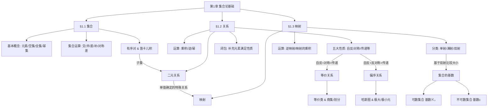

# 第1章 集合论基础 · 章节总结

> 本文件覆盖第1章全部知识点，适合整章复习使用。
> 各小节详细例题与推导请参考文末 📁 小节索引。

---

## 🗺️ 这一章在讲什么

这一章是整个离散数学的“建基之作”，它的核心问题是：**如何用严谨的数学语言，描述离散对象的群体以及它们之间的联系？**
整章沿着一条非常清晰的逻辑主线展开：首先定义了最基础的“散落的元素群体”（集合），接着为了描述这些元素之间的关联，引出了元素结对的结构（关系），最后在关系的基础上，提炼出了一种最严格、单向的对应规则（映射）。它不仅为后续的图论和数理逻辑提供了符号语言，更是我们理解计算机中数据分类、排序与映射的基础。

---

## 🧭 知识演进路线

**第一阶段：用集合框定讨论的边界**

为了在数学中严谨地描述“具有同一性质的客体总体”，我们首先引入了**集合 (Set)** 与**元素 (element)** 的概念。集合具有确定性、互异性（不允许重复）和无序性。为了度量集合的大小和提供运算环境，我们定义了**空集**（不含任何元素的集合，是一切集合的子集）、**全集**（讨论对象的全体）以及集合的**基数**（有限集元素的个数）。

当我们需要比较不同集合的大小范围时，就产生了**子集 (subset)** 与**相等**的概念。证明两个集合相等的通用法则是互相包含。而如果我们要研究一个集合内部所有可能派生出的子集族群，我们就用到了**幂集 (power set)**，它是一个以原集合所有子集为元素的新集合。

有了基本的集合，我们需要像四则运算一样对它们进行合并、截取或排除，这就有了集合的**并集**、**交集**、**差集**、**补集**和**对称差/环和**运算。为了避免每次都用繁琐的文字去推导集合的包含关系，我们总结出了一套代数化的**集合算律**（如分配律、吸收律、De Morgan 律等），这让我们可以像解代数方程一样去证明集合等式。

**第二阶段：从无序走向有序，建立关系**

集合本身是无序的，但在现实应用中（比如坐标、因果联系），元素的先后顺序至关重要。为了打破无序性，我们引入了具有严格次序的**有序对 (ordered pairs)**。将两个集合的所有元素两两组合形成有序对，就得到了**笛卡儿积 (Cartesian product)**，记作 $A \times B$（表示集合 $A$ 和 $B$ 中元素所有可能的有序排列组合）。

笛卡儿积给出了所有可能的联系，但在实际问题中，我们往往只关心特定的联系（比如“选课记录”或“大于等于”）。这种特定的联系，本质上就是笛卡儿积的一个子集，我们将其定义为**二元关系 (binary relation)**。关系不仅可以用集合的交、并、差来运算，还可以像接力赛一样进行**乘积/合成**，或者反向追溯求**逆关系**。

为了更好地对关系进行分类，我们提炼了五种关键的特殊性质：
能否自己和自己发生联系？——**自反性 (reflexive)** 与**反自反性**。
联系是否总是双向的？——**对称性 (symmetric)** 与**反对称性**。
联系能否像接力一样传递？——**传递性 (transitive)**。
如果一个关系天生缺少某种性质，我们可以通过**闭包 (Closure)** 运算（自反闭包、对称闭包、传递闭包），为它补充最少的元素，强制让它穿上这件“性质外衣”。

**第三阶段：关系的两次高阶升华——分类与排序**

具备不同性质的关系，能帮我们解决两类截然不同的宏观问题。
第一类问题是“物以类聚”。当我们想把具有相同特征的元素归为同一类时，我们需要这个关系既能包含自身（自反）、又是双向平等的（对称）、且能连带同类（传递）。同时满足这三者的就是**等价关系 (equivalence relation)**。等价关系把全集切分成了互不相交的**等价类 (equivalence class)**，所有等价类构成的整体叫做**商集 / 划分 (partition)**。计算一个集合能有多少种划分，可以通过第二类 Stirling 数来求解。

第二类问题是“论资排辈”。当我们需要刻画元素之间“大小、先后、包含”的层级结构时，我们需要关系是自反的、传递的，但绝不能是双向平等的（否则大小就乱套了），这就要求它具备反对称性。同时满足这三者的称为**偏序关系 (partial ordering)**。为了直观展示偏序层级，我们剥离了自反的环和传递的冗余线，发明了自底向上的**哈斯图 (Hasse diagram)**。在偏序集中，我们可以寻找统治全局的**最大/小元**，也可以寻找局部登顶的**极大/极小元**，还能为某个子集寻找天花板（**上界/最小上界**）和地板（**下界/最大下界**）。

**第四阶段：最严格的关系——映射与无限的度量**

当一个关系的要求苛刻到“定义域中的每一个元素，都必须有且仅有一个确定的目标元素与之对应”时，关系就进化成了**映射 (mapping)**。
根据对应目标的拥挤程度，映射被分为：**单射 (injection)**（每个目标最多被命中一次，不撞车）、**满射 (surjection)**（所有目标都被命中过，不留空）以及**双射 / 1-1映射 (bijection)**（完美的一一对应）。映射可以反向求**逆映射**，也可以连续作用形成**映射的乘积**。

双射的出现，为数学家提供了一把比较无限集合大小的“尺子”。如果两个集合之间能建立双射，我们就说它们的**基数 (cardinality)** 是相同的，也叫**对等**。
基于这把尺子，无限集合被分为了两大阵营。第一阵营是**可数集合 (countable set)**，它们能和自然数集建立一一对应，基数为 $\aleph_0$。有理数集也是可数的。第二阵营是庞大得多的**不可数集合**，例如实数集，基数为 $c$（连续统基数）。通过著名的“康托尔对角线法”，我们证明了实数是无法像自然数那样逐一编号列举的。这也引出了 Cantor 基本定理：任何集合的基数都严格小于其幂集的基数。

---

## 🧩 思维导图

---

## 🔑 贯穿全章的核心思想

1. **“万物皆集合”的构造思想**
在这一章中，高阶结构总是由底层的集合构造而来的。关系本质上就是笛卡儿积（一种特殊的集合）的子集；而映射本质上又是一种受到严格单值条件约束的特殊关系。这种层层嵌套、用基础概念定义复杂概念的方法，是离散数学最核心的建模思想。
2. **“性质决定结构”的分类思想**
集合本身的元素是平等的，但当我们给它们之间的关系赋予不同性质时，群体就呈现出了截然不同的结构。给关系穿上“对称性”的外衣，元素之间就形成了扁平的“物以类聚”（等价与划分）；给关系穿上“反对称性”的外衣，元素之间就形成了立体的“论资排辈”（偏序与哈斯图）。
3. **“映射是度量无限的尺子”**
对于有限集，我们可以直接数元素的个数来比较大小。但面对无穷世界，“数数”失效了。离散数学通过引入“双射（1-1映射）”作为尺子，只要两个集合的元素能完美结对，它们的大小（基数）就相等。这一思想极其精妙地帮我们区分了自然数级别的“可数无穷”和实数级别的“不可数无穷”。

---

## 📁 小节索引

| 小节 | 文件 | 核心关键词 |
| --- | --- | --- |
| §1.1 集合的基本概念 | `1_1-集合的基本概念.md` | 空集、幂集、笛卡儿积、集合算律 |
| §1.2 关系 | `1_2-关系.md` | 关系矩阵、闭包、等价关系与划分、偏序关系与哈斯图 |
| §1.3 映射 | `1_3-映射.md` | 单射/满射/双射、集合基数、可数与不可数、对角线法 |