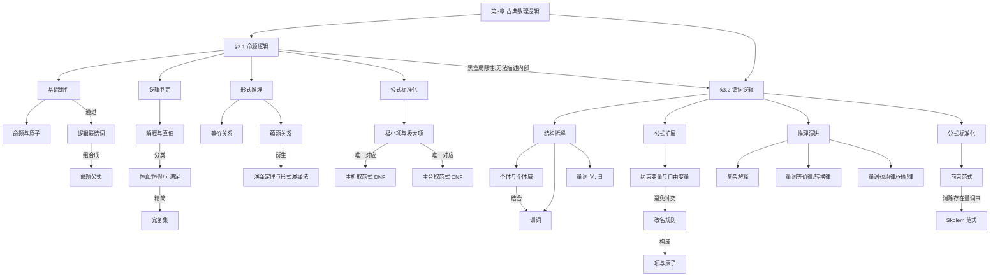

# 第3章 古典数理逻辑 · 章节总结

> 本文件覆盖第3章全部知识点，适合整章复习使用。
> 各小节详细例题与推导请参考文末 📁 小节索引。

---

## 🗺️ 这一章在讲什么

这一章的核心任务是将人类日常的“逻辑推理”转化为严谨的、可计算的“数学符号”。它从最基础的完整陈述句入手，建立了一套判断真假的代数系统（命题逻辑）；随后为了突破其表达瓶颈，进一步深入到句子的内部结构，引入了刻画对象和性质的工具（谓词逻辑）。本章是离散数学中证明论的基石，不仅为后续所有的数学推导提供了严密的规则，也为计算机科学中的自动化推理和算法判定奠定了理论基础。

---

## 🧭 知识演进路线

**命题逻辑：从模糊语言到清晰的符号演算**

日常语言往往充满歧义，为了用数学方法研究思维规律，我们需要将语言抽象为具有确切真假值的符号。因此，我们首先引入了**命题 (Proposition)**，即一句有确切真假意义的陈述句。为了进行运算，我们将最基础的命题符号化为**原子 (Atom)**。但是，单个原子无法表达复杂的逻辑关系，于是我们需要引入**逻辑联结词 (Logical Connectives)**：否定 (Negation) $\neg$、析取 (Disjunction) $\vee$、合取 (Conjunction) $\wedge$、蕴涵 (Implication) $\rightarrow$ 以及等价 (Equivalence) $\leftrightarrow$。通过这些联结词，我们将原子组合成了**命题公式 (Propositional Formula)**。

有了公式，我们立刻面临一个问题：这个公式到底算“真”还是“假”？这就需要**解释 (Interpretation)**。解释就是给公式中的每个原子赋予具体的真假值（0或1）。根据在所有解释下的真值表现，我们将公式分为三类：在所有情况下都为真的是**恒真公式 (Tautology)**；在所有情况下都为假的是**恒假公式 (Contradiction)**；只要存在一种情况为真，就是**可满足公式 (Satisfiable)**。

当我们能判断单个公式的真假后，自然会想比较两个公式是否表达相同的逻辑。如果两个公式在所有解释下的真值都一样，我们就说它们具有**等价 (Equivalence)** 关系。既然很多公式是等价的，我们是否需要这么多逻辑联结词呢？其实不需要。只要某个联结词的集合能够表达出所有逻辑运算，我们就称它为**完备集 (Functionally Complete Set)**，比如仅仅使用 $\{\neg, \wedge\}$ 就能组合出所有其他联结词的效果。

逻辑的核心目的是“推理”，即从前提得出结论。如果前提为真时结论必然为真，我们就说它们之间存在**逻辑蕴涵 (Implication)** 关系。为了在纸面上严谨地推导这种关系，我们建立了一套**形式演绎法 (Formal Deduction)** 规则。借助**演绎定理 (Deduction Theorem)**，我们可以把要证明的条件作为临时前提，一步步推导出结论。

最后，为了让计算机能够自动判定公式的等价性和真假，我们需要一种“标准格式”。这就诞生了**范式 (Normal Forms)**。我们将包含所有原子的基础单元分为使公式为真的**极小项 (Minterm)** 和使公式为假的**极大项 (Maxterm)**。任何一个命题公式，都可以唯一地转化为由极小项构成的**主析取范式 (Principal DNF)**，或者由极大项构成的**主合取范式 (Principal CNF)**，从而让逻辑判断变成了纯粹的机械比对。

**谓词逻辑：深入命题的内部结构与量化表达**

命题逻辑虽然完美，但它把一句话当成了一个不可分割的黑盒。比如著名的三段论：“凡人必死，张三是人，所以张三必死”。在命题逻辑中，这是三个毫无关联的原子，根本无法证明其蕴涵关系。为了打破这个黑盒，我们需要深入句子的内部，由此进入了**谓词逻辑 (Predicate Logic)**。

我们将事物本身抽象为**个体 (Individual)**（如“张三”），并将其所属的范围称为个体名称集合。同时，我们将事物的性质或个体之间的关系抽象为**谓词 (Predicate)**（如“是人”、“必死”）。仅仅有主语和谓语还不够，数学中经常需要表达“所有”或“存在某个”，于是我们引入了**量词 (Quantifier)**：**全称量词 (Universal Quantifier)** $\forall$ 和 **存在量词 (Existential Quantifier)** $\exists$。

量词的引入带来了变量作用范围的问题。被量词直接控制的变量被称为**约束变量 (Bound Variable)**，而没有被量词管辖的变量则是**自由变量 (Free Variable)**。为了避免在推导中产生变量名冲突，我们确立了**改名规则**，允许在不改变逻辑意义的前提下更换约束变量的名称。通过组合个体、变量和函数，我们构成了**项 (Term)**；项与谓词结合形成**原子 (Atom)**，最终再通过量词和逻辑联结词构成谓词逻辑的完整公式。此时，谓词公式的**解释**不仅需要指定真值，还需要明确非空的个体域以及具体的映射关系。

在谓词逻辑中进行推理，我们依然依赖等价与蕴涵关系，但必须加入量词的运算律。例如，量词转换律（德摩根律的延伸）说明了全称与存在的否定关系；而量词分配律则指出了 $\forall$ 对合取 $\wedge$、$\exists$ 对析取 $\vee$ 具有完美的分配特性（需要特别注意 $\forall$ 和 $\vee$ 之间只有蕴涵关系而无等价关系）。

正如命题逻辑需要主范式一样，谓词公式的形式也千变万化，我们需要将其标准化。第一步是将所有量词按照规则提取到公式的最前方，母式不再含有量词，这被称为**前束范式 (Prenex Normal Form)**。为了进一步简化机器证明，我们在前束范式的基础上，通过引入常量或函数，彻底消除了所有的存在量词 $\exists$，这种只保留全称量词的终极标准形态，被称为**Skolem 范式 (Skolem Normal Form)**。至此，全章的逻辑演算体系实现了闭环与升华。

---

## 🧩 思维导图

---

## 🔑 贯穿全章的核心思想

1. **形式化抽象思想**：日常语言充满了直觉上的理所当然和语义歧义。本章的核心在于“剥离语义，保留结构”，无论是命题联结词还是谓词量词，都是将人脑的思维过程变成可以通过真值表或语法规则机械检验的数学符号体系。
2. **等价转换与标准化思想**：从主析取范式到 Skolem 范式，体现了为了适应自动化处理（如计算机判定），必须将形式各异的公式转化为唯一或特定的“标准形态”。通过这种规范化，复杂的逻辑判定问题被巧妙地转化为了代数项的匹配问题。
3. **由宏观入微观的认识演进**：命题逻辑是对逻辑的“宏观”刻画，它将完整的句子视为运算的基本粒子；而当这种宏观模型无法解释三段论等基于内部属性的推理时，理论自然演进到“微观”的谓词逻辑，拆解出主语（个体）和谓语（谓词），并引入量词。这揭示了数学工具总是随着问题复杂度的提升而不断打破重组的发展规律。

---

## 📁 小节索引

| 小节 | 文件 | 核心关键词 |
| --- | --- | --- |
| §3.1 命题逻辑 | `3.1-命题逻辑_ou.pdf` / `.md` | 命题公式、等价与蕴涵、形式演绎法、主析取/合取范式 |
| §3.2 谓词逻辑 | `3.2-谓词逻辑_ou.pdf` / `.md` | 个体与谓词、量词、约束与自由变量、前束范式、Skolem 范式 |