# 第四章 图与网络 · 章节总结

> 本文件覆盖第四章全部知识点，适合整章复习使用。  
> 各小节详细例题与推导请参考文末 📁 小节索引。

---

## 🗺️ 这一章在讲什么

本章以"用点和线描述关系"为出发点，建立了一套完整的图论语言。第一节奠定基础：什么是图、如何度量、如何表示、如何找最短路；第二节聚焦树这种最简洁的连通结构，研究其判定条件与最小代价连通网络（最优树）；第三节为边赋予方向，引出有向图与有向树，并以此为工具彻底解决"一笔画"问题（Euler路）；第四节将目光从边转向点，探讨能否设计一条经过每个点恰好一次的回路（Hamilton图），揭示这类问题迄今没有完美判据的深层困难。整章贯穿一条思路：用结构化的语言把现实中的连通与遍历问题抽象出来，再给出算法或判定条件。

---

## 🧭 知识演进路线

### §4.1 从"点线关系"到图的语言体系

现实中有大量"两两之间存在某种关系"的情形——城市与道路、人与社交关系、国家与外交。要研究这类结构，第一步是把它抽象成数学对象。

**图**（graph）$G = (P, L)$ 就是这样的抽象：$P$ 是点（结点）的非空集合，$L$ 是连接某些不同点对的边集合，且任意两点之间最多有一条边。这样定义出来的图是**简单图**，不允许自环（反身边）和平行边。若 $L(G) = \varnothing$，则称 $G$ 为**零图**（null graph）；若任意两点之间都有边，则称为**完全图**（complete graph），记 $n$ 个点的完全图为 $K_n$。允许反身边和平行边的更广义结构称为**无向图**（multigraph），本章区分了二者。

有了图的概念，立刻面临一个问题：同一个图可以画出许多不同的形状，怎么判断本质上是否相同？这就是**图的同构**（isomorphism）——两图 $G$ 与 $H$ 同构，是指存在点集之间的一一映射 $\sigma$，使得 $u$ 与 $v$ 在 $G$ 中相邻当且仅当 $\sigma(u)$ 与 $\sigma(v)$ 在 $H$ 中相邻。同构的图被视为同一个图。判断同构的必要条件包括：点数、边数、度序列均相同。

研究图的局部结构时，需要"截取一部分"的操作。若 $H$ 的点集和边集都是 $G$ 的子集，则 $H$ 是 $G$ 的**子图**（subgraph）；若还保留了 $G$ 的全部点（只删部分边），则称为**支撑子图**（spanning subgraph）；若选定一个点集后，把原图中两端点都在该点集内的边全部保留，则得到该点集的**诱导子图**（induced subgraph）。三者的核心区别是：诱导子图由选定的点集唯一确定，不允许额外删边；支撑子图保留所有点，可以随意删边。

与子图对应，**补图**（complement graph）$G^c$ 是与 $G$ 点集相同、但边集"取反"的图——两点在 $G$ 中相邻当且仅当在 $G^c$ 中不相邻。$G$ 与 $G^c$ 合并恰好是完全图 $K_n$，这一性质在后面分析 Hamilton 图时会反复用到。

---

有了图的结构语言，下一步是刻画图中每个点的"连接程度"。点 $v$ 的**度**（degree）$d_G(v)$ 定义为以 $v$ 为端点的边的条数，度为 0 的点称为**孤立点**。度是最基础的数量特征，由此出发可以证明一个极其重要的定理：

**握手定理**（Handshaking Lemma，定理 4.1.1）：设图有 $m$ 条边，则
$$\sum_{v \in P(G)} d_G(v) = 2m$$
直觉上，每条边贡献两个端点，所以度数之和恰好是边数的两倍。由此立刻推出：**任意有限图中，奇数度的点的个数为偶数**（定理 4.1.2）——这个推论在后面判断 Euler 路时会作为关键工具。

为了在计算机上存储图，有两种标准矩阵表示：**关联矩阵**（incidence matrix）$M(G)$ 是"点×边"的矩阵，$a_{ij} = 1$ 当且仅当点 $v_i$ 是边 $l_j$ 的端点，每列恰好有两个 1，每行中 1 的个数等于对应点的度；**邻接矩阵**（adjacency matrix）$A(G)$ 是"点×点"的对称方阵，$b_{ij} = 1$ 当且仅当 $v_i$ 与 $v_j$ 相邻，主对角线全为 0。

---

建立了点和边的语言之后，需要描述图中的"行走路线"。从点 $v$ 出发，依次经过相邻的点直到 $v'$，这个点序列称为从 $v$ 到 $v'$ 的**路**（path）；如果路上除起点和终点可以相同外，其余点互不相同，则称为**简单路**（simple path）；如果起点等于终点且路的长度不小于 3，则称为**回路**（circuit）。注意长度为 2 的"往返"不是回路，这是一个容易出错的地方。

两点之间若存在路，就称二者**相连**（connected）。相连关系是 $P(G)$ 上的等价关系（满足自反、对称、传递），等价类构成图的**连通分支**（connected component），分支数记为 $W(G)$。若 $W(G) = 1$，则称图 $G$ 是**连通的**（connected）。连通图与完全图容易混淆：连通图只要求任意两点之间存在路（可以绕行），完全图要求任意两点之间有直接的边，后者是前者的严格加强。

---

现实中的图往往带有距离或费用信息，这就是**权图**（weighted graph，又称网络）——对每条边规定一个实数权 $w(l)$。在权图中，从 $u$ 到 $v$ 的所有路中权和最小的一条称为**最短路**（shortest path），其权和称为 $u$ 到 $v$ 的**距离** $d(u, v)$。当权均为正时，最短路一定是简单路，因此只需在简单路中寻找。

对大型权图，枚举所有简单路不现实。1959 年 Dijkstra 给出了一个高效算法，一次性求出源点 $u_0$ 到**所有其余点**的最短路。其核心思想是引入点到点集的距离：设 $S \subseteq P(G)$，$S' = P - S$，则
$$d(u_0, S') = \min_{\substack{u \in S \\ v \in S'}} \{d(u_0, u) + w(u, v)\}$$
**Dijkstra 算法**从 $S = \{u_0\}$ 出发，每步将距离 $u_0$ 最近的未确定点加入 $S$，直到 $S = P$。正确性由定理 4.1.3 保证：算法每步加入的点到 $u_0$ 的距离确实是最短距离。实操时用"表格法"：维护每个点当前的最短距离标签 $l(v)$，每轮确定 $l$ 值最小的未确定点，再更新其邻居的标签值。

---

### §4.2 树：最简洁的连通结构

连通图中最重要的一类是**树**（tree）——连通且无回路的图。树是"极简"的连通结构：删去任意一条边，图立刻不连通；添加任意一条边，必然产生回路。可以类比地理中的道路网：城市之间恰好有唯一通路，没有任何冗余路线。无回路但可能不连通的图称为**森林**（forest），每个连通分支都是一棵树。

为什么"无回路图必有度为 1 的点"？引理 4.2.1 给出了直觉：从任一有边的点出发，沿相邻关系延伸，由于无回路，路上的点不会重复；图有限，过程必须停止，停止点就是度为 1 的"叶子"。这个引理是证明树的边数公式的技术支撑。

**定理 4.2.1** 是本节的核心——树有五个等价刻画，掌握这五个等价命题既能灵活判断一个图是否为树，也是证明题的主力工具：

- （1）$G$ 是树（连通且无回路）
- （2）$G$ 连通，且删去任意一条边后所得图不连通
- （3）$G$ 中任意两点之间恰有一条简单路
- （4）$G$ 不含回路，且有 $n-1$ 条边（$n$ 为点数，有限图）
- （5）$G$ 连通，且有 $n-1$ 条边（有限图）

这五条等价命题彼此独立揭示了树的一个侧面：（2）说树的每条边都是"桥"，缺一不可；（3）说树中路唯一，没有岔路；（4）（5）说树的边数恰好"刚刚好"——既不多余，也不缺少。

由等价命题（2）立刻推出**推论 4.2.1**：任意有限连通图必有一棵**支撑树**（spanning tree），即包含所有点的树形子图。方法是不断删去回路中的任意一条边，每次删边后仍然连通，重复直到无回路。**推论 4.2.2** 进一步说明：若 $G'$ 是 $G$ 的支撑树，向 $G'$ 添加任一非树边，必然产生唯一的一个回路。这个推论是 Kruskal 算法正确性证明的技术基础。

---

现实中常见的连通网络设计问题是：用最小总代价把所有节点连通起来——修铁路、铺光纤、建电网。将节点建模为点、建设代价为边权，问题转化为寻找**最优树**（minimum spanning tree，又称最小生成树）——权和最小的支撑树。

**Kruskal 算法**用一种直觉上极其自然的贪心策略解决这个问题：每次从剩余边中选权值最小且与已选边不构成回路的边加入，直到选够 $n-1$ 条边为止。判断是否成环的关键是维护已选边的连通分量：若新边的两端点已在同一分量，则加入后成环（跳过）；否则不成环（加入并合并分量）。定理 4.2.2 保证了这种贪心策略的正确性：Kruskal 算法的输出一定是最优树。

最优树有两个充要条件（定理 4.2.3 和 4.2.4）：对树中任意一条边，它在将树分成两棵子树所对应的"割"中权值最小（**割最优条件**）；向树中添加非树边所形成的回路中，该非树边权值最大（**圈最优条件**）。这两个条件是验证最优树的理论工具。

---

### §4.3 有向图、有向树与 Euler 路

无向图中，边 $uv$ 和 $vu$ 是同一条边。但现实中很多关系是单向的——单行道、时序依赖、食物链。为了描述这类不对称关系，需要给边赋予方向，这就引出了**有向图**（directed graph）$G = (P, A)$：$A$ 是**弧**（arc）的集合，每条弧 $e$ 有确定的**起点** $\mathrm{init}(e)$ 和**终点** $\mathrm{fin}(e)$。与无向图不同，有向图允许反身弧（起终点相同的弧）和无穷多条平行弧，且有限有向图中弧数未必有限——"有限"只限制点集。

有向图中每个点有两个度量：**出度**（从该点发出的弧数）和**入度**（到达该点的弧数），度等于二者之和。有向图的行走规则也更严格：从 $v$ 到 $v'$ 的**有向路**必须沿弧方向走，一旦方向不符就无法前进。因此有 $v$ 到 $v'$ 的有向路，未必有 $v'$ 到 $v$ 的有向路，这是有向图与无向图最本质的差别。

---

有向图中的"连通性"概念分裂成三个层次，需要清晰辨析：

- **强连通**（strongly connected）：任意两点之间都有有向路（双向可达）
- **有根**（rooted）：存在一个特殊点 $r$，使得其他任意点到 $r$ 都有有向路（单向汇聚）
- **弱连通**（weakly connected）：忽略方向后（即**漠视图** $G_0$）是连通图

三者的蕴含关系是：强连通 $\Rightarrow$ 有根 $\Rightarrow$ 弱连通，反向均不成立。典型例子：有向树是有根但不强连通的——所有非根点都指向根，但根无法到达任何其他点。

有向图中最规整的结构是**有向树**（directed tree，或有根树，定义 4.3.8）：存在点 $r$ 满足（1）每个非根点 $v \neq r$ 恰好是一条弧的起点（出度恰好为 1）；（2）根 $r$ 的出度为 0；（3）$r$ 是根（任意非根点到 $r$ 有有向路）。由这三条定义可以推出有向树的三条关键性质：每个非根点到 $r$ 恰有**一条**有向路；有向树中**没有有向回路**；两点间**最多一条弧**。证明时均使用反证法，利用定义中的"出度恰好为 1"。

有向树与无向树的联系由**转化定理**（定理 4.3.1）给出：对有向树 $G$，忽略弧的方向得到的 $G_0$ 是一棵无向树；反过来，给一棵无向树 $G_0$ 的任意一点指定为根 $r$，再按"每条边的方向从非根端指向靠近 $r$ 的一端"规则定向，就得到一棵有向树。这一定理把有向树与无向树的研究打通了。

---

有了有向图和有向树的概念，可以讨论本节的核心问题：**Euler 路**（Eulerian path）。Euler 路的灵感来自哥尼斯堡七桥问题——能否一笔走完图中每条弧恰好一次，并回到出发点？**Euler 路**定义为有向路 $(e_1, \ldots, e_n)$，满足 $\mathrm{fin}(e_n) = \mathrm{init}(e_1)$（首尾衔接），且每条弧恰好出现一次。有 Euler 路的有向图称为 **Euler 图**（Eulerian graph）。

两个容易混淆的点：Euler 路允许同一个**点**被多次经过（它不是简单有向路），但每条**弧**恰好经过一次；Euler 路也不一定经过图中所有点（孤立点可以不在路上）。Euler 路本质上是一条封闭的"一笔画路线"。

什么样的有向图有 Euler 路？判断的关键在于**平衡性**。若有向图中每个点的入度和出度均有限且相等，则称该有向图是**平衡的**（balanced）。定理 4.3.2（Euler 图充要条件）给出完整刻画：**无孤立点的有限有向图 $G$ 有 Euler 路，当且仅当 $G$ 是平衡的且强连通。** 等价地，可以把"强连通"弱化为"漠视图 $G_0$ 连通"（推论），这在实际判断中更方便操作。

Euler 路与有向树之间存在深刻的转化关系，由两个定理刻画：**定理 4.3.3** 说明从一条 Euler 路可以构造一棵有向树——令 $r$ 为 Euler 路的起终点，对每个非根点 $v$，令 $e[v]$ 为 $v$ 在 Euler 路中**最后一次出发**时走的弧，则全部点加上弧集 $\{e[v] \mid v \neq r\}$ 构成以 $r$ 为根的有向树。**定理 4.3.4** 则反向：给定平衡有向图的一棵有向支撑树，按照"每个点 $v$ 的树中指定弧 $e[v]$ 最后走"的规则，可以从根的任意出弧出发，系统地生成 Euler 路。

---

### §4.4 Hamilton 图：遍历点的难题

Euler 路关注的是"遍历所有弧"，而 **Hamilton 路**关注的是"遍历所有点"——经过图中每个点**恰好一次**。这仅是一字之差，难度却天壤之别。

**Hamilton 路**（Hamiltonian path）是经过图中每点恰好一次的路；若起点和终点相同，则称为 **Hamilton 回路**（Hamiltonian circuit）；含有 Hamilton 回路的图称为 **Hamilton 图**（Hamiltonian graph）。完全图 $K_m$ 一定是 Hamilton 图。Hamilton 路一定是简单路（不重复经过点），这与 Euler 路（允许重复经过点，只要弧不重复）形成对比。另一个重要性质：Hamilton 路恰好是图的一棵**支撑树**（$n-1$ 条边，连通所有点），Hamilton 回路是图的支撑子图。

判断 Hamilton 图有几条基本工具。如果图中有度为 1 的点，则无 Hamilton 回路；如果有度为 0 的孤立点，则既无 Hamilton 路也无 Hamilton 回路；度为 2 的点若在 Hamilton 回路中，则其两条边必须全用上。

---

**如何判断一个图不是 Hamilton 图？**定理 4.4.1 给出一个必要条件：若 $G$ 是 Hamilton 图，则对 $P(G)$ 的任意非空子集 $S$，删去 $S$ 及相关边后，剩余图的**连通分支数** $W(G-S) \leq |S|$。其**逆否命题**才是实际工具：若存在某个点集 $S$ 使得 $W(G-S) > |S|$，则 $G$ 一定不是 Hamilton 图。注意这是必要条件，其逆不成立——满足 $W(G-S) \leq |S|$ 对所有 $S$ 成立，不能推出是 Hamilton 图（Petersen 图是经典反例）。

---

**如何判断一个图是 Hamilton 图？**这比"排除"难得多，目前只有若干充分条件。

从度数出发，**定理 4.4.2（Dirac 条件）** 说：若有限图 $G$ 的点数 $\gamma \geq 3$，且最小度 $\delta \geq \gamma/2$，则 $G$ 是 Hamilton 图。直觉是每个点连接的邻居都足够多，使得整个图非常"稠密"，必然存在 Hamilton 回路。

比 Dirac 条件更强的工具是**闭合图**（closure）$C(G)$（定义 4.4.3）：反复连接图中不相邻且度之和 $\geq \gamma$ 的点对，直到不存在这样的点对为止，最终所得图就是 $G$ 的闭合图。闭合图有两个关键性质：（1）$C(G)$ 是唯一确定的（引理 4.4.2，与加边顺序无关）；（2）**Bondy-Chvátal 定理**（定理 4.4.3）：$G$ 是 Hamilton 图，**当且仅当** $C(G)$ 是 Hamilton 图。由此推出：**若 $C(G)$ 是完全图，则 $G$ 是 Hamilton 图**。这个推论比定理 4.4.2 更强——Dirac 条件保证每对不相邻点的度之和 $\geq \gamma$，从而直接把 $C(G)$ 变成完全图，所以 4.4.2 是此推论的特例。

**定理 4.4.4（度序列判别法）** 从不减度序列 $(d_1 \leq d_2 \leq \cdots \leq d_\gamma)$ 出发：若不存在 $m < \gamma/2$ 同时满足 $d_m \leq m$ 且 $d_{\gamma-m} < \gamma - m$，则 $G$ 是 Hamilton 图。注意：若存在这样的 $m$，本定理**不适用**，既不能判定是也不能判定不是。定理 4.4.4 强于定理 4.4.2，但与定理 4.4.3 互相不包含。

三个判据的使用策略是：先尝试用定理 4.4.1 的逆否命题排除；若排除不掉，再依次用 4.4.2（最简单）、4.4.3（计算闭合图）、4.4.4（度序列逐一验证）来确认。

---

关于非 Hamilton 图的结构，**定理 4.4.5** 给出刻画：任何非 Hamilton 图都可以被某个 $C_{m,\gamma}$ 图（由 $K_m^c$、$K_m$、$K_{\gamma-2m}$ 三部分连接而成的图）**度增大**（即度序列逐分量不超过 $C_{m,\gamma}$ 的度序列）。这一定理的推论恰好给出了定理 4.4.4 的等价形式，也给出了基于边数的判别：若 $n$ 个点的图边数 $\geq \dfrac{(n-1)(n-2)}{2} + 2$，则是 Hamilton 图。

---

## 🧩 思维导图

```mermaid
graph TD
    A[第四章 图与网络] --> B[§4.1 图]
    A --> C[§4.2 树]
    A --> D[§4.3 有向图·Euler路]
    A --> E[§4.4 哈密顿图]

    B --> B1[基本定义]
    B1 --> B1a[图/零图/完全图]
    B1 --> B1b[同构]
    B1 --> B1c[子图/支撑子图/诱导子图]
    B1 --> B1d[补图]

    B --> B2[度与矩阵]
    B2 --> B2a[度/孤立点]
    B2 --> B2b[握手定理]
    B2 --> B2c[关联矩阵]
    B2 --> B2d[邻接矩阵]

    B --> B3[路与连通]
    B3 --> B3a[路/简单路/回路]
    B3 --> B3b[相连/连通图]
    B3 --> B3c[连通分支 W G]

    B --> B4[权图与最短路]
    B4 --> B4a[权图/距离]
    B4 --> B4b[Dijkstra算法]

    C --> C1[树的定义]
    C1 --> C1a[树/森林]
    C1 --> C1b[引理4.2.1 叶子存在]

    C --> C2[五个等价命题]
    C2 --> C2a[连通+无回路]
    C2 --> C2b[删边不连通]
    C2 --> C2c[两点唯一简单路]
    C2 --> C2d[无回路+n-1条边]
    C2 --> C2e[连通+n-1条边]

    C --> C3[支撑树]
    C3 --> C3a[推论4.2.1 必有支撑树]
    C3 --> C3b[推论4.2.2 添边成环]

    C --> C4[最优树]
    C4 --> C4a[最小生成树定义]
    C4 --> C4b[Kruskal算法]
    C4 --> C4c[割最优/圈最优条件]

    D --> D1[有向图基础]
    D1 --> D1a[弧/起终点/出入度]
    D1 --> D1b[有向路/简单有向路]
    D1 --> D1c[有向回路]
    D1 --> D1d[漠视图]

    D --> D2[连通层次]
    D2 --> D2a[强连通]
    D2 --> D2b[有根]
    D2 --> D2c[弱连通]
    D2a -->|强于| D2b
    D2b -->|强于| D2c

    D --> D3[有向树]
    D3 --> D3a[定义三条件]
    D3 --> D3b[三条性质]
    D3 --> D3c[转化定理4.3.1]

    D --> D4[Euler路]
    D4 --> D4a[Euler路/Euler图]
    D4 --> D4b[平衡有向图]
    D4 --> D4c[充要条件定理4.3.2]
    D4 --> D4d[Euler路↔有向树]
    D4d --> D4d1[定理4.3.3 路到树]
    D4d --> D4d2[定理4.3.4 树到路]

    E --> E1[定义]
    E1 --> E1a[Hamilton路/回路/图]
    E1 --> E1b[六条基本性质]

    E --> E2[必要条件]
    E2 --> E2a[定理4.4.1 W G-S ≤ S]
    E2 --> E2b[逆否判非Hamilton]

    E --> E3[充分条件]
    E3 --> E3a[定理4.4.2 Dirac δ≥γ/2]
    E3 --> E3b[闭合图C G]
    E3b --> E3b1[定理4.4.3 Bondy-Chvátal]
    E3b --> E3b2[C G完全图推论]
    E3 --> E3c[定理4.4.4 度序列法]

    E --> E4[结构刻画]
    E4 --> E4a[C m,n图]
    E4 --> E4b[定理4.4.5 度增大]

    B3 -->|路的概念延伸| D1b
    C3a -->|支撑树推广| D4d2
    C2 -->|转化定理利用| D3c
    E1a -->|遍历点vs遍历弧| D4a
```

---

## 🔑 贯穿全章的核心思想

**一、抽象建模：把现实问题变成图的问题。** 全章每一小节都在做同一件事：将现实中的连通/遍历/最优化问题映射到图论语言，再用图论工具求解。七桥问题变成 Euler 图判定，修铁路最省钱变成最优树，旅行路线问题变成 Hamilton 图……这种"建模转化"的思维方式是学习本章的根本方法，而非孤立记忆各个定理。

**二、充要条件的不对等性。** 本章展示了图论判定问题的两个极端：Euler 图的充要条件极为简洁（平衡且连通，一句话搞定）；而 Hamilton 图至今只有各种充分条件，没有令人满意的充要条件（判定 Hamilton 图是 NP 完全问题）。这个对比提醒我们：两个看起来相似的遍历问题（遍历弧 vs. 遍历点），在数学复杂度上可以天差地别。

**三、贪心算法的适用性：局部最优导致全局最优。** Dijkstra 算法和 Kruskal 算法都是贪心算法的典型。Dijkstra 每次确定"距离最近的未访问点"；Kruskal 每次选"最小权且不成环的边"。二者的正确性都来自一个共同的结构特征：每一步的局部最优选择，不会因为后续步骤而变得"不再最优"。理解这一点，不仅帮助记忆算法，也帮助理解何时贪心策略奏效（最短路、最小生成树），何时不奏效（Hamilton 回路）。

---

## 📁 小节索引

| 小节 | 文件 | 核心关键词 |
|------|------|------------|
| §4.1 图 | `4_1_图.md` | 图的定义、握手定理、关联矩阵/邻接矩阵、连通性、Dijkstra算法 |
| §4.2 树 | `4_2_树.md` | 树/森林、五个等价命题、支撑树、最优树、Kruskal算法 |
| §4.3 有向图·Euler路 | `4_3_有向图.md` | 有向图、有向树、强连通/有根/弱连通、Euler图充要条件、定理4.3.3/4.3.4 |
| §4.4 哈密顿图 | `4_4_哈密顿图.md` | Hamilton路/回路/图、必要条件、Dirac条件、闭合图、度序列判别法 |