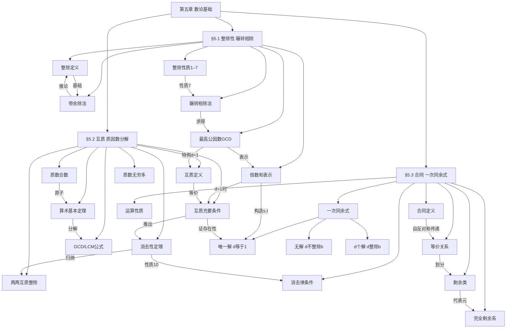

# 第五章 数论基础 · 章节总结

> 本文件覆盖第五章全部知识点（§5.1–§5.3），适合整章复习使用。  
> 各小节详细例题与推导请参考文末 📁 小节索引。

---

## 🗺️ 这一章在讲什么

数论基础这一章的核心问题是：**整数与整数之间有什么结构性关系？** 全章沿着一条清晰的主线推进：先用**整除**描述"能不能被整除"，再用**最高公因数**刻画两个整数之间的公因数结构，再从最高公因数引出**互质**和**质因数分解**，最后把整除的语言升级成更灵活的**合同（同余）**记号，并在此基础上求解**一次同余式**。整章是一个层层递进的知识生长链，每一节都为下一节提供工具。在离散数学课程中，本章为后续的秦九韶定理（中国剩余定理）和欧拉函数奠定了全部理论基础。

---

## 🧭 知识演进路线

### §5.1 整除性与辗转相除：奠基层

要研究整数，首先要问：两个整数 $a$ 和 $b$ 之间最基本的关系是什么？答案是**整除**（divisibility）。当存在整数 $c$ 使得 $a = bc$ 时，就说 $b$ 整除 $a$，记为 $b \mid a$。这里 $b$ 叫作 $a$ 的因数（divisor），$a$ 叫作 $b$ 的倍数（multiple）。有两个特殊情形值得记牢：$0$ 可以被任何整数整除，但 $0$ 自己不能整除任何数（因为用 $0$ 做除数无意义）；$\pm 1$ 能整除一切整数。

但是，两个整数并不总能被整除。那"除不尽"时余数的结构是什么？**带余除法定理**（定理5.1.1）回答了这个问题：对任意整数 $a$ 和非零整数 $b$，唯一存在整数 $q$（商）和 $r$（余数）使得

$$a = qb + r, \quad 0 \leq r < |b|$$

这个定理是整章的地基，因为 $b \mid a$ 等价于余数 $r = 0$，而辗转相除法正是依靠反复做带余除法来运作的。

有了整除的基本定义，接下来整理整除的性质，建立"证明工具链"。整除满足传递性（性质1）、可与倍数复合（性质2）、对加减封闭（性质3）、保线性组合（性质4），还有一条特别重要的规律：若 $a = qb + c$，则 $a, b$ 的公因数集合与 $b, c$ 的公因数集合**完全相同**（性质7）。正是这条性质奠定了辗转相除法的理论依据，也是后面一切计算的出发点。

自然地，两个整数可能有多个公共因数——哪个最"大"？这里"大"不是指数值最大，而是指**在整除意义下最大**：如果所有公因数都整除 $d$，则 $d$ 就是 $a, b$ 的**最高公因数**（greatest common divisor，GCD），记为 $(a, b)$。最高公因数除符号外是唯一的，约定取正值。

怎么求最高公因数？**辗转相除法**（欧几里得算法）给出了系统答案：从 $a, b$ 出发，每轮用上一步的除数和余数继续做带余除法，余数序列严格递减，最终必会终止。最后一个非零余数就是 $(a, b)$（定理5.1.2）。这一点的道理在于：由性质7，每一步的公因数集合都不变，所以最终余数就是最高公因数。

光知道最高公因数的数值还不够——**定理5.1.3** 进一步保证：最高公因数 $d = (a, b)$ 总可以表示为 $a, b$ 的整数倍数之和，即存在整数 $s, t$ 使得 $d = sa + tb$。实际计算时，用辗转相除各步的商 $q_k$ 递推辅助量 $S_k, T_k$：

$$S_k = q_k S_{k-1} + S_{k-2}, \quad T_k = q_k T_{k-1} + T_{k-2}$$

初值为 $S_0 = 0,\, S_1 = 1,\, T_0 = 1,\, T_1 = q_1$，最终得 $d = (-1)^{n-1} S_n \cdot a + (-1)^n T_n \cdot b$，其中 $n$ 是使余数第一次达到 $d$ 的步数。这个倍数和表示在 §5.3 解一次同余式时将被直接调用。

### §5.2 互质与质因数分解：结构层

有了最高公因数，一个自然的特殊情形就是 $(a, b) = 1$——两个整数除 $\pm 1$ 外没有其他公因数，称为**互质**（coprime）。互质是整除理论中最强力的条件，一旦成立，就能使用多条原本不能用的推论。

定理5.2.1 给出互质的等价刻画：$a, b$ 互质**当且仅当**存在整数 $s, t$ 使 $sa + tb = 1$。充分性一看便知（若 $d$ 是公因数，则 $d \mid sa + tb = 1$，故 $d = \pm 1$）；必要性则直接来自 §5.1 的定理5.1.3（最高公因数可表为倍数和，$d=1$ 时即得）。这个等价刻画是后续所有互质相关证明的"万能钥匙"。

基于互质条件，有两条核心工具定理。**定理5.2.2**（互质的消去性）说：若 $(a,b)=1$ 且 $a \mid bc$，则 $a \mid c$。没有互质条件时这个结论不成立，例如 $6 \mid 4 \times 3$ 但 $6 \nmid 3$，因为 $(6,4) = 2 \neq 1$。**定理5.2.4**（两两互质整除乘积）说：若 $m_1, \ldots, m_k$ 两两互质且都整除 $a$，则它们的乘积 $m_1 m_2 \cdots m_k$ 也整除 $a$。这条定理是证明整除性的核心技巧——先把整除目标分解为若干两两互质的子目标，逐一证明，再综合得结论。定理5.2.3 作为中间工具保证：$b$ 若与 $a_1, \ldots, a_n$ 各自互质，则 $b$ 与乘积 $a_1 \cdots a_n$ 也互质。

认识互质之后，下一个问题是：整数有没有"原子"分解？**算术基本定理**（Fundamental Theorem of Arithmetic，定理5.2.6）给出了肯定答案：任意大于 1 的正整数恰有唯一方式写成质数（prime）乘积（不计顺序）。所谓质数（素数），是指大于 1 且除 1 和自身外没有其他正因数的整数；正整数被三分为 1、质数、合数（composite number）三类，1 被单独排出是为了保证分解的唯一性。

算术基本定理的标准形式（推论5.2.2）是**标准质因数分解式**：任意整数（$\neq 0, \neq \pm 1$）唯一写成 $\pm p_1^{r_1} \cdots p_n^{r_n}$，其中 $p_i$ 两两不同为质数，$r_i \geq 1$。基于这个分解式，若 $a = p_1^{r_1} \cdots p_n^{r_n}$，$b = p_1^{s_1} \cdots p_n^{s_n}$（某些指数可为 0），则

$$
(a,b) = p_1^{\min(r_1,s_1)} \cdots p_n^{\min(r_n,s_n)}, \quad [a,b] = p_1^{\max(r_1,s_1)} \cdots p_n^{\max(r_n,s_n)}
$$

其中 $[a,b]$ 是最低公倍数（least common multiple，LCM）。此外，$a$ 的正因数个数为 $(r_1+1)(r_2+1)\cdots(r_n+1)$。

定理5.2.5 是算术基本定理唯一性证明的工具：若质数 $p$ 整除乘积 $a_1 \cdots a_n$，则 $p$ 必整除其中某个 $a_i$。这和定理5.2.2 非常相关——质数 $p$ 与不被它整除的任意数互质，从而定理5.2.2 的消去性可以应用。

最后，欧几里得定理（定理5.2.7）告诉我们质数有无穷多——反证法：若质数只有有限个 $p_1, \ldots, p_n$，构造 $N = p_1 p_2 \cdots p_n + 1$，则 $N$ 不被任何 $p_i$ 整除（余数均为 1），矛盾。

### §5.3 合同与一次同余式：应用层

整除写起来有时不够灵活，特别是在研究余数相关问题时。为此引入**合同（congruence，同余）**记号：若 $m \mid (a - b)$，则称 $a$ 合同于 $b$ 模 $m$，记为

$$a \equiv b \pmod{m}$$

这等价于 $a$ 和 $b$ 被 $m$ 除余数相同。特别地，$a \equiv 0 \pmod{m}$ 等价于 $m \mid a$，所以合同记号完全兼容原来的整除语言，但表达更灵活，运算更方便。讨论合同时约定 $m$ 为正整数。

合同关系满足自反性、对称性、传递性（性质1–3），因此是一种**等价关系**，将全体整数划分为 $m$ 个等价类，每个等价类叫作模 $m$ 的**剩余类**（residue class）。从每个剩余类中各取一个代表元，得到的 $m$ 个整数构成**完全剩余系**（complete residue system），最常用的是 $\{0, 1, \ldots, m-1\}$，即非负最小完全剩余系。判断 $m$ 个整数是否构成完全剩余系，等价于检验它们两两模 $m$ 不同余。

合同的运算性质（性质4–8）非常接近普通等式：可以两侧同加、同减、同乘，两个合同式可以对应相加或相乘，还可以两侧同取幂次。整系数多项式也满足合同：若 $x \equiv y \pmod{m}$，则 $p(x) \equiv p(y) \pmod{m}$（性质13）。这是证明"整数被某数整除的数码特征"的标准工具——例如 $10 \equiv 1 \pmod{9}$，所以每个十进位都可以用其系数代替，从而整数 $N$ 模 9 等于各位数字之和模 9。

合同最微妙的地方在**消去律**（性质9–12）——它**不能无条件消去**。若 $ac \equiv bc \pmod{m}$，不能直接推出 $a \equiv b \pmod{m}$。正确的规律是：若 $(c, m) = d$，消去 $c$ 后模也要除以 $d$，即得 $a \equiv b \pmod{m/d}$（性质11）；特别地，若 $(c, m) = 1$，才能直接消去得 $a \equiv b \pmod{m}$（性质10）。

有了合同的基础，就可以研究含整数变量的合同式——**一次同余式**（linear congruence）$ax \equiv b \pmod{m}$，其本质等价于不定方程 $ax - my = b$。解的个数由 $d = (a, m)$ 完全决定，分三种情形：

若 $d = 1$（$a$ 与 $m$ 互质），由定理5.3.1，方程**恰有唯一解**。存在性来自§5.2的互质充要条件：$(a,m)=1$ 保证存在 $s,t$ 使 $sa+mt=1$，从而 $x = sb$ 就是一个解；唯一性则由性质10消去 $a$ 得到。

若 $d > 1$ 且 $d \nmid b$，由定理5.3.2，方程**无解**——因为 $d$ 整除左边但不整除右边，矛盾。

若 $d > 1$ 且 $d \mid b$，由定理5.3.3，方程有**恰好 $d$ 个解**。做法是先将方程两边同除以 $d$，化为 $(a/d)x \equiv b/d \pmod{m/d}$，此时新方程系数与模互质，由定理5.3.1 得唯一解 $\alpha$（满足 $0 \leq \alpha < m/d$），原方程的 $d$ 个解则为 $\alpha, \alpha + m/d, \alpha + 2m/d, \ldots, \alpha + (d-1)m/d$。

求解互质情形的具体方法有两种课内方法：**方法一**用辗转相除法构造 $1 = as + mt$，取 $x \equiv sb \pmod{m}$；**方法二**反复利用合同性质乘以适当整数逐步将系数化为 1。两种方法适用情形不同——方法一系统但计算量略大，方法二在系数较小时可能更快。

---

## 🧩 思维导图

---

## 🔑 贯穿全章的核心思想

**一、化归（Reduction）思想：把复杂问题降规模**。辗转相除法是这一思想最直接的体现——每一步都把"求 $(a,b)$"转化为规模更小的"求 $(b,r)$"，直到平凡情形。解一次同余式也是如此：有多个解时先解简化方程，再扩展出全部解。整章几乎每个算法都在重复这一套"把大问题变成小问题"的思路。

**二、条件与工具的精确匹配**。整除和合同中充斥着"有条件才能用"的工具：消去律需要互质，定理5.2.4需要两两互质，一次同余式有解的充要条件需要 $d \mid b$。每次用工具之前都必须验证条件是否满足，这是本章最容易出错的地方，也是考试最喜欢考的地方。

**三、整除、互质、合同三种语言的统一**。这三个概念描述的本质是同一件事——整数之间的倍数关系，只是表达角度不同。整除直接描述倍数关系，互质是最高公因数为 1 的特殊情形，合同是把余数相等包装成类似等式的记号。理解了三种语言的内在统一，就能在证明中灵活切换，选取最方便的表达方式。

---

## 📁 小节索引

| 小节 | 文件 | 核心关键词 |
|------|------|------------|
| §5.1 整除性 辗转相除 | `5_1_整除性辗转相除.md` | 整除定义、带余除法、整除性质、GCD、辗转相除法、倍数和表示 |
| §5.2 互质 质因数分解 | `5_2_互质质因数分解.md` | 互质定义、充要条件、消去性、两两互质整除、质数、算术基本定理、LCM、质数无穷多 |
| §5.3 合同 一次同余式 | `5_3_合同一次同余式.md` | 合同定义、13条性质、消去律、剩余类、完全剩余系、一次同余式、三种情形、辗转相除求解 |