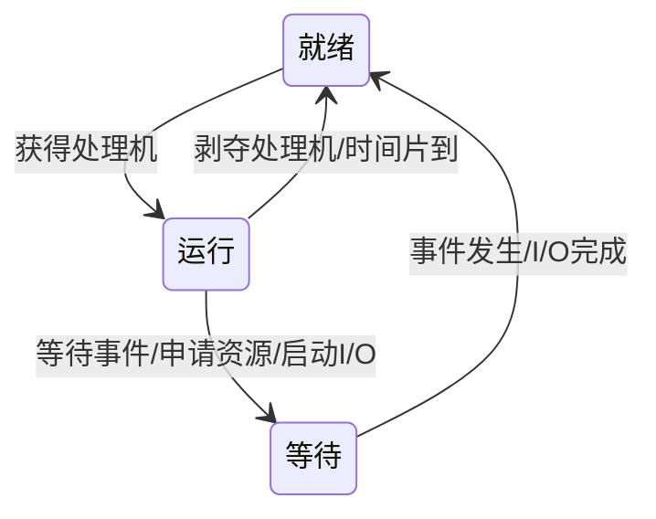

# 02 进程、线程与作业（深度版）

> 本章目标：从“为什么需要进程”开始，建立对进程、线程、作业的直觉。  
> 课内边界：本章只深讲多道程序、进程、线程、作业。CPU 调度算法放第 3 章，PV 同步放第 4 章，死锁放第 5 章。

---

## 0. 本章定位与考试价值

第 2 章是操作系统课程的地基。后面的调度、同步、死锁、内存管理、文件和设备管理，都默认你已经理解“系统中运行的单位是什么”“操作系统如何描述它们”“它们为什么会暂停、等待、恢复”。

从考试角度看，本章常以选择题和基础判断题出现，也会作为后续大题的隐含前提。比如：

- 做 CPU 调度题，必须知道就绪态和运行态。
- 做 PV 同步题，必须知道进程并发推进会带来不确定性。
- 做死锁题，必须知道进程会占有资源、等待资源。
- 做 fork 题，必须知道父子进程复制和返回值。
- 做线程题，必须知道线程共享什么、私有什么。

本章最重要的主线是：

```text
单道程序效率低
    ↓
多道程序提高资源利用率
    ↓
多道程序需要描述“正在运行的程序”
    ↓
引入进程：程序的一次运行活动
    ↓
进程太重，切换和通信开销大
    ↓
引入线程：进程内部更轻量的执行流
    ↓
用户提交的完整任务称为作业，作业进入系统后可对应多个进程
```

### 0.1 本章重点速查表

| 重点 | 来源 | 掌握要求 |
|---|---|---|
| 【必会】进程 vs 程序：动态/静态、本质区别 | 作业一第 1、9 题；习题课回顾 | 会判断、会解释 |
| 【必会】PCB：进程控制块、进程存在标志、进程组成 | 作业一第 1 题；习题课回顾 | 会判断、会说作用 |
| 【必会】进程三态与状态转换 | 作业一第 5、6 题；习题课回顾 | 会画图、会判断非法转换 |
| 【必会】`fork()` 进程数 | 作业一第 2 题 | 会计算总进程数和新建进程数 |
| 【必会】父子进程关系 | 作业一第 7 题 | 会判断 PID、PCB、地址空间关系 |
| 【必会】进程 vs 线程 | 作业一第 3 题；真题选择题；习题课回顾 | 会判断资源/调度/地址空间 |
| 【重点】多道程序设计收益与代价 | 作业一第 4 题；习题课回顾 | 会解释“不是越多越好” |
| 【重点】线程结构与实现：共享/私有、用户级/核心级/混合 | 习题课回顾；真题选择题 | 会区分、会排除错误选项 |

> 应试优先级：先保证表中 `【必会】` 全部能闭卷解释，再回头看 UNIX 细节、vfork、Java/Windows 示例等理解性内容。

---

## 1. 从单道到多道：为什么引入进程

### 1.1 单道程序设计的直觉

单道程序设计就是：内存中一次只放一个程序，这个程序独占 CPU、内存和设备，直到它完成或告一段落。

这听起来简单，但效率很差。原因是程序运行过程中不可能一直使用 CPU。比如一个程序要处理磁盘数据：

```text
读磁盘数据 -> CPU 处理 -> 写设备 -> 再读下一块
```

读磁盘和写设备时，CPU 可能没有事做；CPU 处理时，磁盘和打印机可能没有事做。于是整个系统里很多资源都在等待。

课内给出的单道缺点是：

- 处理机利用率低。
- 设备利用率低。
- 内存利用率低。

### 1.2 【重点】多道程序设计的提出

多道程序设计的基本想法是：既然一个程序等待 I/O 时 CPU 空着，那就让另一个程序趁机使用 CPU。

也就是说，系统中同时保存多个程序，让它们交替推进：

```text
程序 A 等磁盘时 -> 程序 B 用 CPU
程序 B 等打印机时 -> 程序 A 继续用 CPU
```

这样做的目标是提高系统效率，尤其是提高吞吐量。

课件中的核心表述：

```text
提高处理机、设备、内存等各种资源的利用率，从而提高系统效率。
```

这里要特别注意：多道程序不是程序越多越好。

如果道数过少，资源利用率低；如果道数过多，操作系统管理开销变大，程序响应速度下降。多道程序的道数应该和系统资源数量相当。

【易错】考试判断：

- “多道程序一定提高单个程序运行速度”是错的。
- “进程数越多 CPU 效率越高”是错的。
- “多道程序支持并发执行”是对的。
- “多道程序需要共享资源管理”是对的。

应试口诀：

```text
多道提高“系统资源利用率”，不保证“单个程序更快”；
道数太多会增加系统开销。
```

### 1.3 多道程序带来的问题

多道程序一出现，操作系统就不能只负责“启动一个程序，等它结束”。它必须管理多个同时存在的程序。

课内列出的多道程序问题主要有三类：

1. 处理机资源管理  
   程序个数大于处理机个数，CPU 到底给谁用？

2. 存储资源管理  
   多个程序同时在内存中，地址空间如何相对独立？哪些内容可以共享？内存和外存如何分配与回收？

3. 设备资源管理  
   多个程序都想用设备时，设备如何分配？I/O 如何控制？

这些问题共同指向一个核心需求：操作系统必须有一种数据结构来描述“一个正在运行、可能暂停、可能恢复、可能等待资源的程序”。这就是进程。

---

## 2. 【必会】进程的直觉、定义与特征

### 2.1 程序为什么不够用

程序是静态的。它可以是磁盘上的一个可执行文件，也可以是一段代码。它只告诉你“如果运行，应当执行哪些指令”。

但操作系统真正要管理的是动态运行过程。比如同一个程序运行两次：

```text
打开两个终端，都运行 vim
```

磁盘上的 `vim` 程序只有一份，但系统中有两个正在运行的 `vim`。它们打开的文件不同，光标位置不同，内存数据不同，等待的事件也可能不同。显然，“程序”这个概念不够描述它们。

所以需要“进程”。

直觉上：

```text
程序 = 菜谱
进程 = 按菜谱正在做菜的一次过程
```

菜谱可以长期保存，也可以被很多人同时使用；做菜过程有开始、有中途状态、有锅碗食材、有当前做到哪一步，也会结束。

### 2.2 【必会】课内定义

课件中给出的进程定义包括：

```text
可参与并发执行的程序称为进程。
进程是具有一定独立功能的程序关于一个数据集合的一次运行活动。
```

定义强调两个方面：

- 动态性：进程是执行中的程序。
- 并发性：进程可以和其他进程同时推进。

更完整地说，进程不是单纯的代码，而是“程序 + 数据 + 当前运行状态 + 操作系统管理信息”的整体。

【题型】作业一第 1、9 题都在考这件事：不要把进程说成“完整的程序”。看到“程序是静态、进程是动态”直接锁定为核心判断。

### 2.3 进程的特征

课内列出进程的特征：

| 特征 | 解释 | 考试判断 |
|---|---|---|
| 并发性 | 可以与其他进程一道向前推进 | 并发不等于物理同时执行 |
| 动态性 | 动态产生、消亡，状态不断变化 | 进程和程序的本质区别 |
| 独立性 | 是可以调度的基本单位 | 课内进程口径强调独立调度 |
| 交往性 | 进程之间可能通信、同步、互斥 | 后续第 4 章展开 |
| 异步性 | 各进程以不可预知速度推进 | 导致并发结果不确定 |
| 结构性 | 每个进程有一个 PCB | PCB 标志进程存在 |

最容易考的是动态性：程序是静态的，进程是动态的。

### 2.4 并发与并行

课件专门区分了 concurrent 和 parallel：

| 概念 | 中文 | 直觉 | 是否要求多个 CPU |
|---|---|---|---|
| concurrent | 并发 | 宏观同时，交替执行 | 不要求 |
| parallel | 并行 | 微观同时，真正同时执行 | 要求 |

单 CPU 系统也可以并发。因为 CPU 在多个进程之间快速切换，用户感觉多个程序都在推进。

但单 CPU 系统不能真正并行执行两个 CPU 指令流。真正并行需要多个 CPU 或多核。

考试陷阱：

- “并发一定要求多个处理机”是错的。
- “并行一定是并发的一种更强形式”可以这样理解。

---

## 3. 【必会】进程控制块 PCB：操作系统认识进程的方式

### 3.1 PCB 的直觉

操作系统不是人，它不能说“我看见有个程序正在运行”。它必须通过数据结构来管理对象。

PCB 就是操作系统给每个进程建立的档案。它保存系统管理这个进程所需的全部信息。

直觉上：

```text
PCB = 进程身份证 + 病历本 + 行程表 + 资源清单 + 现场快照
```

没有 PCB，操作系统就不知道：

- 这个进程是谁？
- 当前处于什么状态？
- 它在等什么？
- 它打开了哪些文件？
- 它的下一条指令在哪里？
- CPU 被切走后如何恢复它？

### 3.2 【必会】课内定义

课件定义：

```text
PCB 是标志进程存在的数据结构，其中保存系统管理进程所需的全部信息。
```

这句话有两个关键词：

1. 标志进程存在  
   建立 PCB 意味着进程被创建；撤销 PCB 意味着进程被撤销。

2. 管理所需全部信息  
   PCB 不一定保存程序代码本身，但保存管理、调度、恢复、资源回收所需的信息。

### 3.3 PCB 常见内容

课件列出的 PCB 内容包括：

| 类别 | 典型内容 | 为什么需要 |
|---|---|---|
| 标识信息 | PID、UID、父进程 PID | 区分进程和用户，形成进程家族 |
| 状态信息 | 运行、就绪、等待等 | 决定它能否被调度 |
| 现场信息 | PSW、PC、寄存器 | 切换回来后能继续执行 |
| 地址信息 | 程序和数据所在位置 | 完成地址映射和装入 |
| 调度参数 | 优先级、CPU 使用时间 | 调度算法需要 |
| 打开文件 | 文件表指针 | 文件读写需要 |
| 消息指针 | 通信相关信息 | 进程通信需要 |
| 队列指针 | 链入就绪/等待队列 | 操作系统组织进程 |

【题型】考试判断：

- “进程可以由程序、数据和 PCB 描述”是对的。
- “PCB 是进程存在的标志”是对的。
- “撤销 PCB 就意味着撤销进程”按课内口径是对的。

---

## 4. 进程的组成与上下文

### 4.1 进程由什么组成

课件给出的进程组成：

```text
进程 = PCB + 程序
程序 = 代码 + 数据 + 堆栈
```

其中：

- 代码 code：CPU 要执行的指令。
- 数据 data：全局变量、静态数据等。
- 栈 stack：返回点、参数、返回值、局部变量。
- 堆 heap：动态分配变量。
- PCB：操作系统管理该进程的控制信息。

所以可以更直观地写成：

```text
进程 = PCB + 代码 + 数据 + 栈 + 堆
```

### 4.2 进程影像 Process Image

课件中说：

```text
进程的程序（代码和数据）称为进程影像。
```

你可以把进程影像理解为：进程在内存中的用户空间内容。它描述这个进程“作为程序运行时”的样子。

但完整进程不仅有进程影像，还要有 PCB 和系统环境。

### 4.3 进程上下文 Process Context

课件定义：

```text
进程的物理实体与支持进程运行的物理环境统称为进程上下文。
```

包括：

- PCB + 程序。
- 地址空间。
- 系统栈。
- 打开文件表。
- CPU 寄存器现场。

上下文是“暂停以后还能恢复”的关键。

如果一个进程正在执行到第 100 条指令，CPU 被切给另一个进程。等它下次回来时，必须继续从第 100 条之后执行，而不是从头开始。这就需要保存上下文。

### 4.4 上下文切换与系统开销

上下文切换是：

```text
由一个进程的上下文转到另一个进程的上下文。
```

这不是免费的。操作系统要保存当前进程寄存器、PC、PSW，修改 PCB，切换地址空间，恢复另一个进程现场。这些管理工作会消耗时间和空间。

课件把这种管理开销称为 system overhead。

考试判断：

- 多道程序能提高资源利用率，但会增加系统开销。
- 进程切换比线程切换开销大，因为进程上下文包含更多内容。

---

## 5. 【必会】进程状态、队列与状态转换

### 5.1 为什么进程需要状态

一个进程不是一直在 CPU 上运行。它可能：

- 已经准备好，只差 CPU。
- 正在 CPU 上执行。
- 正在等待磁盘 I/O。
- 正在等待某个事件。
- 刚创建，还没进入就绪队列。
- 已结束，正在清理。

为了管理这些情况，操作系统给进程设置状态。

### 5.2 【必会】课内三种基本状态

课件中的基本状态是：

| 状态 | 英文 | 直觉 | 关键判断 |
|---|---|---|---|
| 运行态 | RUN | 占有 CPU，正在向前推进 | 单 CPU 某时刻最多一个 |
| 就绪态 | READY | 可以运行，但没有得到 CPU | 只差 CPU |
| 等待态 | WAIT | 等待某一事件发生 | 即使 CPU 空闲也不能运行 |

注意“等待态”也常叫阻塞态。

### 5.3 状态转换

课内状态转换：

```text
就绪 -> 运行：获得处理机
运行 -> 就绪：处理机被剥夺
运行 -> 等待：申请资源未得到，或启动 I/O
等待 -> 就绪：得到资源，或 I/O 中断发生
```

用图表示：



### 5.4 【易错】两个高频不可能转换

1. 就绪 -> 等待  
   就绪进程没有 CPU，不能执行“申请资源”或“启动 I/O”的动作，所以不能直接进入等待。

2. 等待 -> 运行  
   等待事件发生后，进程只是具备了运行条件，必须先进入就绪队列，再由调度程序选择后进入运行。

考试看到状态转换题，先问自己：

```text
这个动作需要进程自己执行吗？
如果需要，它必须先处于运行态。
```

例如：

- 等待输入数据：等待态。
- 等待分配时间片：就绪态。
- 正唤醒一个协作进程：运行态，因为它正在执行唤醒操作。

【题型】作业一第 5、6 题直接考这里。最常见错误是把“等待 CPU 时间片”看成等待态；其实它只缺 CPU，所以是就绪态。

### 5.5 考虑创建和终止的状态

课件后面还给出考虑生灭的状态转换：

```text
初创/创建 -> 就绪 -> 运行 -> 终止
```

创建进程时，系统要建立 PCB、分配内存、加载程序、放入就绪链。进程结束时，系统要回收资源、撤销 PCB、通知父进程。

### 5.6 进程队列

操作系统用 PCB 组成队列管理进程：

- 就绪队列：可以运行、等待 CPU 的进程。
- 等待队列：等待某个事件的进程。通常每个等待事件一个队列。
- 运行指示字：每个处理机一个，指向当前运行进程。

注意：队列不一定是 FIFO，也可能按优先级或调度算法组织。

直觉：

```text
就绪队列 = 候诊区
运行进程 = 正在看诊的人
等待队列 = 去等化验结果的人
事件发生 = 化验结果出来，回候诊区
```

---

## 6. 【必会】进程创建、撤销与 fork

### 6.1 课内创建过程

课件概括：

```text
建立 PCB，分配内存，加载程序，入就绪链。
```

也就是说，创建进程不是只“运行一段代码”，而是操作系统建立一个可被调度和管理的实体。

### 6.2 进程撤销

课件概括：

```text
去配资源，撤销 PCB，通知父进程。
```

进程结束后，操作系统要回收它占用的内存、打开文件、设备等资源，并处理父子进程关系。

### 6.3 【必会】父进程与子进程

课件强调：

```text
除初始进程外，其他进程由父进程创建，并形成进程家族。
```

父子进程关系中要记住：

- 父子进程可以并发执行。
- 父子进程有不同 PID。
- 父子进程有不同 PCB。
- 子进程通常从父进程复制而来。
- 父进程可以等待子进程结束。

【易错】考试中“父子进程共享虚拟地址空间”通常是错的。`fork()` 后父子进程逻辑上拥有独立地址空间；即使现代系统用写时复制优化，也不能说它们共享同一个虚拟地址空间。

### 6.4 UNIX fork 的课内口径

课件说明：

```c
pid = fork();
```

fork 创建子进程。子进程是父进程的复制品。

返回值：

- 在父进程中，`fork()` 返回子进程编号，是大于 0 的整数。
- 在子进程中，`fork()` 返回 0。

典型结构：

```c
pid = fork();
if (pid == 0) {
    /* 子进程代码 */
} else {
    /* 父进程代码 */
}
```

这段代码不是 if 同时执行两个分支，而是 fork 之后有两个进程分别执行：

- 子进程看到 `pid == 0` 成立。
- 父进程看到 `pid == 0` 不成立。

### 6.5 【题型】【必会】fork 进程数题

作业题：

```c
void main() {
    fork();
    fork();
}
```

问总共创建多少个进程。

推导：

```text
开始：1 个进程
第一次 fork：每个现有进程复制一次 -> 2 个进程
第二次 fork：2 个现有进程各复制一次 -> 4 个进程
```

答案：总共有 4 个进程。  
如果问“新创建了几个子进程”，则是 3 个。作业题问“总共创建了几个进程”，按选项答案为 4。

通用公式：

```text
n 次连续 fork 后，总进程数 = 2^n
新创建子进程数 = 2^n - 1
```

应试口诀：

```text
问“总共有几个进程”看 2^n；
问“新创建几个进程”看 2^n - 1。
```

### 6.6 exec、exit、wait

课件还介绍：

- `execl(prog, args)`：加载并执行新程序，覆盖原来的程序，从第一条指令开始执行。
- `exit(status)`：进程自我结束，并给出终止状态。
- `wait(&status)`：父进程等待子进程终止，返回终止子进程编号。

这组调用的直觉：

```text
fork：复制出一个新进程
exec：让子进程换一个程序运行
exit：子进程结束
wait：父进程等待并回收子进程结束信息
```

### 6.7 fork 与 vfork

课件提到：

fork：

- 复制地址空间。
- 复制控制结构。
- 父子进程有各自独立的数据拷贝。
- 若马上加载新程序，复制地址空间可能浪费。

vfork：

- 只复制控制结构。
- 不复制地址空间。
- 父子进程暂时共享地址空间。
- 子进程通常马上使用 exec 改变地址空间。

期末若只考基础，重点掌握 fork 即可；vfork 作为理解材料。

---

## 7. 进程之间的联系与作用

### 7.1 相关进程与无关进程

课件把进程联系分成：

1. 相关进程  
   同一家族的进程，可能共享文件，需要通信，协调推进速度。父进程可以监视子进程，子进程完成父进程交给的任务。

2. 无关进程  
   没有逻辑关系，但同时执行的进程。它们仍可能竞争资源，因此会出现互斥、死锁、饥饿。

### 7.2 相互作用

课件中出现了：

- send / receive：通信。
- sync / wait：同步等待。
- hold R：占有资源。

这些内容会在后续章节展开。第 2 章只需要知道：进程不是孤立运行的，它们之间可能通信、同步、竞争资源。

---

## 8. 【必会】线程与轻量级进程：为什么需要线程

### 8.1 进程的问题：太重

进程能解决“多道程序中如何描述一个运行单位”的问题，但进程也有缺点：

- 进程上下文内容多。
- 进程切换开销大。
- 相关进程之间通信不方便。
- 每个进程有独立地址空间，协作成本高。

课件说进程切换上下文涉及：

```text
PCB + 程序 + 地址空间 + 系统栈 + 打开文件表
```

这些东西让进程显得“笨重”。

### 8.2 线程的引入

如果一个应用内部有多个活动，它们天然共享大量数据，那么用多个进程实现就显得浪费。

例如 Word：

- 一个线程负责交互编辑。
- 一个线程负责词法检查。
- 一个线程负责定时保存。

例如 HTTP server：

- 每个 HTTP 请求可以由一个线程处理。

这些活动属于同一个应用，应该共享代码、数据、打开文件等资源，但又希望能并发推进。于是引入线程。

直觉：

```text
进程 = 一个工厂
线程 = 工厂里的工人
```

工厂拥有厂房、设备、仓库；工人共享这些资源，但每个工人有自己的当前任务和工具状态。

### 8.3 【必会】线程的概念

线程是进程内部的执行流。一个进程可以包含多个线程，至少包含一个线程。不支持多线程的系统，可以把每个进程看成单线程进程。

习题课口径：

```text
线程：进程内部执行流，共享资源。
```

【易错】线程不能脱离进程独立运行；“一个进程一定包含多个线程”也是错的，一个进程至少包含一个线程。

### 8.4 【必会】线程结构

课件中的多线程结构强调：

共享：

- 程序代码。
- 静态数据。
- 动态堆。
- 地址空间。
- 打开文件等进程资源。

私有：

- 寄存器。
- 栈。
- 程序计数器 PC。

为什么线程必须有私有栈和寄存器？

因为每个线程都要独立执行函数调用。函数调用需要保存返回地址、参数、局部变量。如果多个线程共用一个栈，函数调用会互相覆盖。

【题型】真题多线程题常用“共享地址空间/私有栈和寄存器”做选项陷阱。判断线程题时先问：这是同一个进程内部的多个执行流吗？

### 8.5 线程控制块 TCB

课件定义：

```text
TCB 是标志线程存在的数据结构，其中包含对线程管理需要的全部信息。
```

TCB 内容包括：

- 线程标识。
- 线程状态。
- 调度参数。
- 现场：通用寄存器、PC、SP。
- 链接指针。

TCB 存放位置取决于线程实现：

- 用户级线程：TCB 在用户空间，由运行时系统管理。
- 核心级线程：TCB 在系统空间，由内核管理。

---

## 9. 【重点】用户级线程、核心级线程、混合线程

### 9.1 【易错】用户级线程 ULT

用户级线程由用户态线程库实现，操作系统内核不知道这些线程的存在。

课件口径：

- 基于 library 函数。
- 系统不可见。
- 线程创建、撤销、状态转换在目态完成。
- TCB 在用户空间。
- 每个进程一个系统栈。

优点：

- 不依赖操作系统。
- 调度灵活。
- 同一进程内线程切换快，因为不需要进入内核。

缺点：

- 同一进程中的多个用户级线程不能真正并行。
- 一个线程进入系统调用阻塞，整个进程可能被阻塞，其他线程也不能执行。

【题型】考试判断：

- “用户级线程切换需要内核支持”通常是错的。
- “用户级线程对操作系统可见”是错的。
- “用户级线程切换开销小”是对的。

### 9.2 【易错】核心级线程 KLT

核心级线程由操作系统内核支持和管理。

课件口径：

- 基于系统调用。
- 创建、撤销、状态转换由操作系统完成。
- TCB 在系统空间。

优点：

- 同一进程内多个线程可以在多处理机上并行执行。
- 一个线程进入内核等待，其他线程仍可执行。

缺点：

- 系统开销大。
- 同一进程内线程切换速度较慢。
- 调度灵活性不如用户级线程库。

【题型】考试判断：

- “核心级线程的切换需要内核支持”是对的。
- “核心级线程可以真正并行”在多处理机环境下是对的。

### 9.3 混合线程

混合线程把用户级线程和核心级线程结合起来。课件以 Solaris 为例：

- User level thread：由库支持创建和调度。
- Lightweight process, LWP：轻量级进程，对操作系统可见。
- Kernel thread：由内核支持。
- 用户级线程与 LWP 可以多对多。
- 每个 LWP 与唯一一个核心线程对应。

直觉上，混合模型是在用户线程和内核线程之间加了一层 LWP：

```text
用户线程 -> LWP -> 核心线程 -> CPU
```

这样既想保留用户级线程的灵活，又想利用核心级线程的并行能力。

---

## 10. 作业与进程

### 10.1 作业的概念

课件定义：

```text
作业是用户要求计算机系统为其完成的计算任务集合。
```

作业更接近“用户提交的一项完整工作”，进程更接近“系统中实际运行和调度的实体”。

### 10.2 作业步

作业步是作业处理过程中的一个相对独立步骤。

课件口径：

- 一般一个作业步可由一个进程完成。
- 某些作业步之间可以并行。

例如一个批处理作业可能包括：

```text
编译 -> 链接 -> 执行 -> 输出结果
```

每一步都可以看成作业步。

### 10.3 批处理作业

批处理作业通过 JCL（作业控制语言）描述控制意图。作业说明书是 JCL 语句序列。

典型形式：

```text
$JOB J1
$FORTN ...
$LINK ...
$EXEC ...
$ENDJOB
```

作业控制程序负责解释并处理作业说明书。执行作业控制程序的进程称为作业控制进程。

### 10.4 交互式作业

交互式作业涉及用户注册、注销、命令解释程序等。

命令解释程序的基本过程：

```text
显示提示符 -> 读入终端命令 -> 分析命令
    -> 内部命令：直接处理
    -> 外部命令：建立子进程执行
    -> 后台命令：输出子进程号，不等待
    -> 前台命令：等待子进程结束
```

### 10.5 作业、进程、线程关系

课件小结：

```text
作业进入内存后变为进程。
一个作业通常与多个进程相对应。
一个进程一般包含多个线程，至少包含一个线程。
不支持多线程的系统，可视为单线程进程。
```

更准确的理解：

```text
作业：用户角度的一项完整任务
进程：操作系统资源分配和运行管理的单位
线程：进程内部的执行流
```

---

## 11. 【题型】课内题型归纳与逐题解析

### 11.1 【必会】进程定义题

题干：下列几种关于进程的叙述，最不符合对操作系统中的进程的理解的是？

选项要点：

- 进程可以由程序、数据和 PCB 描述。
- 进程是程序在一个数据集合上运行的过程。
- 线程是一种特殊的进程。
- 进程是在多程序并行环境中的完整的程序。

答案：进程是在多程序并行环境中的完整的程序。

解析：

进程不是“完整的程序”。程序是静态代码，进程是程序的一次运行活动。把进程说成程序，忽略了动态状态、数据集合、PCB、资源和上下文。

另外，“线程是一种特殊的进程”也不严谨，但在这道作业题中最不符合的是 D，因为它直接把进程等同于程序。复习时应记住：线程不是脱离进程存在的特殊进程，而是进程内部执行流。

### 11.2 【必会】fork 计数题

题干：

```c
void main() {
  fork();
  fork();
}
```

问程序执行完成后总共有几个进程。

答案：4。

解析：

第 1 次 fork 后，1 变 2。  
第 2 次 fork 时，两个进程都会执行这一句，所以 2 变 4。

如果题目问创建了多少个“新进程”，答案才是 3。看清题干。

### 11.3 【必会】进程和线程判断题

题干：下列关于进程和线程的叙述中，正确的是？

正确项：

```text
不管系统是否支持线程，进程都是资源分配的基本单位。
```

解析：

线程共享进程资源，因此线程不是资源分配基本单位。支持线程后，线程可成为 CPU 调度的基本单位，但资源仍属于进程。

错误项分析：

- “线程是资源分配的基本单位，进程是调度的基本单位”：反了。
- “系统级线程和用户级线程的切换都需要内核支持”：用户级线程切换不需要。
- “同一进程中的各线程拥有各自不同地址空间”：错，同一进程线程共享地址空间。

### 11.4 【重点】多道程序题

题干：下列关于多道程序系统的叙述中，不正确的是？

错误项：

```text
进程数越多 CPU 效率越高。
```

解析：

多道程序可以提高资源利用率，但道数过多会导致系统开销增大，响应速度下降。课件明确说，道数应与系统资源数量相当。

正确项：

- 多道系统需要实现共享资源管理。
- 多道系统不必一定支持虚拟存储管理。
- 多道系统支持进程并发执行。

### 11.5 【必会】状态转换题

题干：进程三种基本状态之间，不正确的转换是？

答案：

```text
就绪 -> 等待
```

解析：

等待态通常由运行态进程主动申请资源、启动 I/O 或等待事件导致。就绪进程没有 CPU，不能执行这些动作。

### 11.6 【必会】等待态判断题

题干：当一个进程处于什么状态时，称为等待状态？

答案：

```text
正等待输入一批数据。
```

解析：

等待输入数据表示等待 I/O 事件发生，所以是等待态。等待分配时间片是就绪态，因为它只差 CPU。

### 11.7 【必会】父子进程关系题

题干：关于父进程与子进程的叙述中，错误的是？

答案：

```text
父进程与子进程共享虚拟地址空间。
```

解析：

父子进程可以并发执行，有不同 PCB，有不同 PID。fork 后子进程从父进程复制而来，但逻辑上是独立进程，不能简单说共享虚拟地址空间。

### 11.8 【必会】进程与程序本质区别题

题干：进程和程序的一个本质区别是？

答案：

```text
前者是动态的，后者是静态的。
```

解析：

这是本章最核心的判断。程序是静态代码，进程是程序在数据集合上的一次运行活动，有生命周期和状态变化。

### 11.9 【题型】真题：多线程系统的特长

题干：下列描述中，哪一个不是多线程系统的特长？

选项包括：

- 利用线程并行执行矩阵乘法。
- Web 服务器利用线程响应 HTTP 请求。
- 键盘驱动程序为每个正在运行的应用配备一个线程响应该应用键盘输入。
- GUI 调试程序用不同线程处理输入、计算和跟踪。

解析方向：

多线程适合一个应用内部存在多个可并发控制流，并且这些控制流共享同一进程资源。Web server、GUI 程序、矩阵计算都可能适合多线程。键盘驱动为每个正在运行应用都配一个线程的说法不像“多线程应用内部并发”的典型优势，也容易混淆设备驱动和应用线程。

做这类题时，不要只看“有没有多个活动”，还要看这些活动是否属于同一进程内部、是否共享数据、是否适合用线程组织。

### 11.10 【题型】真题：线程正确叙述

题干：下面叙述中正确的是？

正确项：

```text
引入线程可提高程序并发执行的程度，可进一步提高系统效率。
```

错误项：

- 线程不能脱离进程独立运行。
- 线程引入通常是为了降低而不是增加执行时空开销。
- 一个进程至少包含一个线程，不一定包含多个线程。

---

## 12. 易混概念总表

| 易混概念 | 一句话区分 |
|---|---|
| 程序 vs 进程 | 程序是静态代码，进程是动态运行活动 |
| 进程 vs 线程 | 进程拥有资源，线程是进程内执行流 |
| 并发 vs 并行 | 并发是宏观同时推进，并行是微观同时执行 |
| 就绪 vs 等待 | 就绪只差 CPU，等待还缺事件或资源 |
| PCB vs TCB | PCB 管进程，TCB 管线程 |
| 进程影像 vs 进程上下文 | 影像偏用户程序内容，上下文还包括系统环境和现场 |
| fork vs exec | fork 复制进程，exec 加载新程序覆盖原程序 |
| exit vs wait | exit 是子进程结束，wait 是父进程等待子进程结束 |
| 用户级线程 vs 核心级线程 | 用户级内核不可见且切换快，核心级内核可见且可并行 |
| 作业 vs 进程 | 作业是用户任务集合，进程是系统运行管理实体 |

---

## 13. 期末自测清单

### 13.1 概念自测

- [ ] 【重点】能说明为什么单道程序处理机、设备、内存利用率低。
- [ ] 【必会】能解释为什么多道程序不是道数越多越好。
- [ ] 能说出多道程序带来的处理机、存储、设备管理问题。
- [ ] 【必会】能用自己的话解释“程序是静态的，进程是动态的”。
- [ ] 【必会】能说明 PCB 为什么是进程存在的标志。
- [ ] 【重点】能列出 PCB 至少 5 类常见信息。
- [ ] 能解释进程影像和进程上下文。
- [ ] 能说明上下文切换为什么有系统开销。

### 13.2 状态自测

- [ ] 【必会】能画出运行、就绪、等待三态转换图。
- [ ] 【必会】能解释为什么没有“就绪 -> 等待”。
- [ ] 【必会】能解释为什么没有“等待 -> 运行”。
- [ ] 【必会】能判断“等待输入数据”和“等待时间片”分别是什么状态。
- [ ] 能说明就绪队列和等待队列的区别。

### 13.3 fork 与父子进程自测

- [ ] 【必会】能写出 fork 在父进程和子进程中的不同返回值。
- [ ] 【必会】能计算连续 n 次 fork 后的总进程数。
- [ ] 【必会】能说明父子进程有不同 PID 和 PCB。
- [ ] 能说明 exec、exit、wait 的作用。

### 13.4 线程自测

- [ ] 【必会】能解释为什么引入线程。
- [ ] 【必会】能说出同一进程内线程共享哪些资源。
- [ ] 【必会】能说出线程私有哪些内容。
- [ ] 【重点】能比较用户级线程和核心级线程的优缺点。
- [ ] 能说明 TCB 的作用和可能存放位置。

### 13.5 作业自测

- [ ] 能解释作业、作业步、进程之间的关系。
- [ ] 能说明批处理作业和交互式作业的区别。
- [ ] 能理解命令解释程序为什么可能创建子进程。

---

## 14. 本章一句话收束

第 2 章要建立的核心直觉是：操作系统不是直接管理“程序文件”，而是管理一个个会创建、运行、等待、恢复、结束的动态实体。这个实体在资源层面叫进程，在执行流层面可以进一步拆成线程；用户提交给系统的完整任务叫作业。只要这条线通了，后面的调度、同步、死锁都会自然很多。
