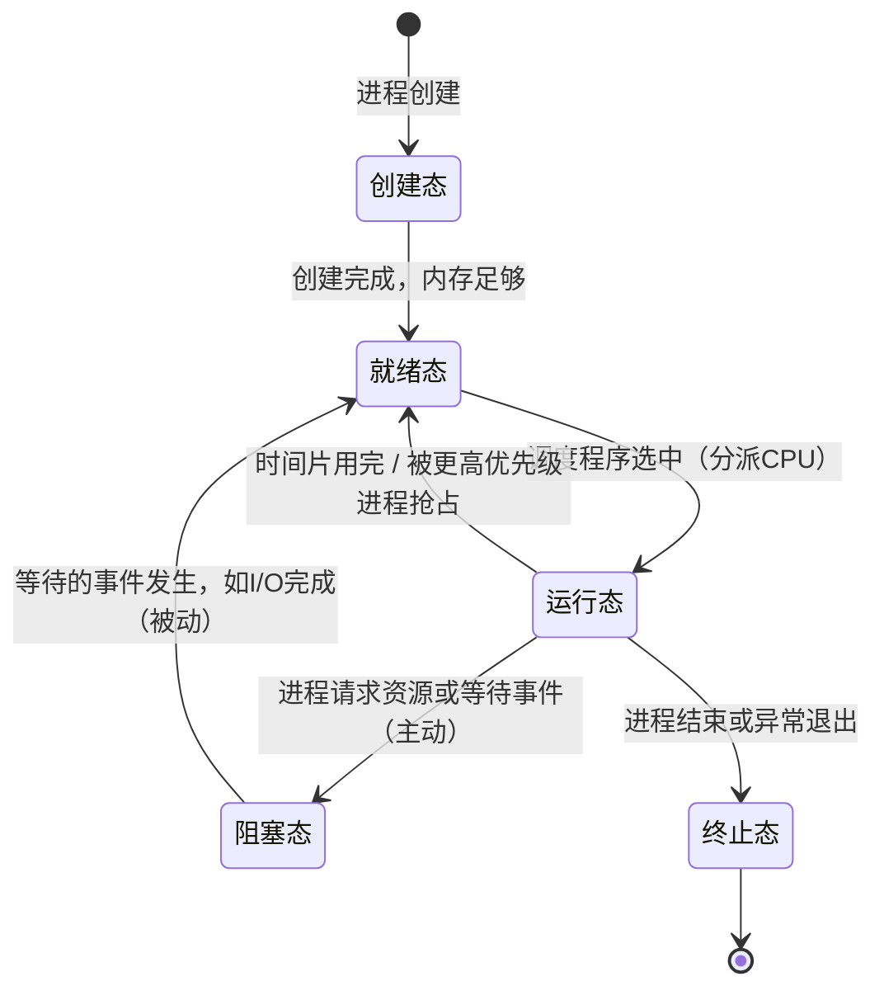

# 2.1 进程与线程

> 本节定位：本节覆盖进程与线程的全部基础概念，包括进程的定义/组成/状态转换/控制/通信，以及线程的概念、实现方式与多线程模型。同步互斥（PV操作）放在2.3节，死锁放在2.4节。
> 来源：王道2026版《操作系统考研复习指导》2.1节。

---

## 知识框架

```
2.1 进程与线程
│
├── 第一层：回答"进程是什么/由什么组成"的问题
│   ├── 2.1.1 进程的概念和特征
│   │   ├── 引入原因（多道程序失去封闭性）
│   │   ├── 进程的定义（三种典型 + 传统定义）
│   │   └── 进程的四个特征
│   └── 2.1.2 进程的组成
│       ├── PCB（进程控制块）——核心
│       ├── 程序段
│       ├── 数据段
│       └── PCB的组织方式（链接/索引）
│
├── 第二层：回答"进程处于什么状态/如何转换"的问题
│   └── 2.1.3 进程的状态与转换
│       ├── 5种状态（运行/就绪/阻塞/创建/终止）
│       └── 6条合法转换 + 2条不可能转换（陷阱）
│
├── 第三层：回答"操作系统如何控制进程"的问题
│   └── 2.1.4 进程控制
│       ├── 原语的概念
│       ├── 创建原语（4步）
│       ├── 终止原语（5步）
│       ├── 阻塞原语 Block（3步）
│       └── 唤醒原语 Wakeup（3步）
│
├── 第四层：回答"进程之间如何交换信息"的问题
│   └── 2.1.5 进程的通信
│       ├── 共享存储（低级/高级）
│       ├── 消息传递（直接/间接）
│       ├── 管道通信
│       └── 信号
│
└── 第五层：回答"线程是什么/如何实现"的问题
    └── 2.1.6 线程和多线程模型
        ├── 线程定义与属性
        ├── 线程与进程的比较（6维度）
        ├── 线程私有/共享资源
        ├── 线程控制块TCB
        ├── ULT vs KLT（实现方式）
        └── 多线程模型（多对一/一对一/多对多）
```

各层递进逻辑：先建立进程的静态认知（是什么/由什么组成）→ 再理解其动态生命周期（状态转换）→ 再看OS如何主动干预（进程控制）→ 再看进程间如何协作（通信）→ 最后引入线程作为更轻量的执行单元。

---

## 第一层：进程是什么、由什么组成

### 1.1 进程的概念

**引入背景**：在多道程序环境下，多个程序并发执行，程序失去封闭性，表现出间断性和不可再现性。"程序"这个静态概念无法描述这种动态执行过程，因此引入进程（Process）。

**进程的典型定义**（三种角度）：
1. 进程是一个正在执行程序的实例。
2. 进程是一个程序及其数据从磁盘加载到内存后，在CPU上的执行过程。
3. 进程是一个具有独立功能的程序在一个数据集合上运行的过程。

**传统定义**：进程是进程实体的运行过程，是系统进行资源分配和调度的一个独立单位。

> [!NOTE]
> 进程实体（进程映像）= 程序段 + 相关数据段 + PCB。创建进程 = 创建PCB；撤销进程 = 撤销PCB。

**进程的四个特征**（了解即可，王道原文"通常不会直接考查"）：
1. **动态性**：进程是程序的一次执行，有创建、活动、暂停、终止等过程，具有一定的生命周期。动态性是进程最基本的特征。
2. **并发性**：多个进程同存于内存中，在一段时间内同时运行。
3. **独立性**：进程是能独立运行、独立获得资源和独立接受调度的基本单位。凡未建立PCB的程序，不能作为独立单位参与运行。
4. **异步性**：进程按各自独立的、不可预知的速度向前推进，异步性会导致执行结果的不可再现性，为此需配置进程同步机制。

### 1.2 进程的组成

进程实体由以下三部分构成，其中最核心的是PCB。

#### PCB（进程控制块）

PCB在进程创建时由OS新建，常驻内存，在进程结束时删除。**PCB是进程存在的唯一标志**，系统唯有通过PCB才能感知到某个进程的存在。

PCB通常包含四类信息：

| 类别 | 主要内容 |
|---|---|
| 进程描述信息 | 进程标识符PID、用户标识符UID |
| 进程控制和管理信息 | 进程当前状态、进程优先级、代码运行入口地址、程序的外存地址、进入内存时间、CPU占用时间、信号量使用 |
| 资源分配清单 | 代码段指针、数据段指针、堆栈段指针、文件描述符、键盘、鼠标 |
| 处理机相关信息（CPU上下文） | 通用寄存器值、地址寄存器值、控制寄存器值、标志寄存器值、状态字 |

**PCB的组织方式**：
- **链接方式**：将同一状态的PCB链接成一个队列，不同状态对应不同队列（就绪队列、多个阻塞队列）。
- **索引方式**：将同一状态的进程组织在一个索引表中，索引表的表项指向对应的PCB，不同状态对应不同索引表。

#### 程序段

被进程调度程序调度到CPU执行的程序代码段。程序可被多个进程共享，即多个进程可以运行同一个程序。

#### 数据段

进程对应程序加工处理的原始数据，或程序执行时产生的中间或最终结果。

---

## 第二层：进程处于什么状态/如何转换

### 2.1 五种状态

通常进程有以下5种状态，前3种是进程的基本状态：

| 状态 | 含义 | 关键说明 |
|---|---|---|
| **运行态** | 进程正在CPU上运行 | 单CPU中任意时刻只有**一个**进程处于运行态 |
| **就绪态** | 已获得除CPU外的一切所需资源，一旦得到CPU便可立即运行 | 系统中可有**多个**就绪进程，排成就绪队列 |
| **阻塞态（等待态）** | 正在等待某一事件而暂停运行，如等待资源可用或等待I/O完成 | 即使CPU空闲，该进程也不能运行 |
| **创建态** | 进程正在被创建，尚未转到就绪态 | 若内存不足则停留在创建态，等待内存资源 |
| **终止态** | 进程正从系统中消失 | 可能是正常结束或其他原因退出运行 |

> [!IMPORTANT]
> **区分就绪态和阻塞态**：就绪态仅缺少CPU；阻塞态缺少的是其他资源（除CPU之外）或等待某一事件。在分时系统中，进程得到CPU的时间很短且非常频繁，进程在运行中实际上是频繁地转换到就绪态的；而其他资源（如外设）的使用时间相对较长，进程转换到阻塞态的次数相对较少。就绪态和阻塞态是进程生命周期中两个完全不同的状态。

### 2.2 状态转换



**6条合法转换详解**：

| 转换方向 | 触发原因 |
|---|---|
| 创建→就绪 | 进程创建完成，获得了内存等必要资源 |
| 就绪→运行 | 调度程序选中该进程，分配CPU时间片 |
| 运行→就绪 | 时间片用完被剥夺CPU；或出现更高优先级进程（可剥夺调度） |
| 运行→阻塞 | 进程主动请求某资源失败、等待I/O完成、等待某事件发生 |
| 阻塞→就绪 | 等待的事件到来（如I/O完成），由中断处理程序将其唤醒 |
| 运行→终止 | 进程任务完成、运行异常或被外界强制终止 |

> [!WARNING]
> **两条不可能发生的转换（高频考陷阱）**：
> - **就绪→阻塞 ❌**：就绪态进程没有在运行，不可能主动发出等待请求。阻塞是进程自身的主动行为，必须由运行态进程来执行（调用Block原语）。
> - **阻塞→运行 ❌**：阻塞态进程缺少的不只是CPU，还缺少其他资源或等待事件，不能直接跳过就绪态获得CPU。
>
> 命题追踪：引起进程状态转换的事件（2014、2015、2018、2023年统考）；执行中断处理程序时进程的状态（2023年统考）

> [!IMPORTANT]
> **主动与被动**：运行态→阻塞态是进程**主动**的行为（进程自己调用Block原语）；阻塞态→就绪态是**被动**的行为，需要其他相关进程的协助（调用Wakeup原语）。

---

## 第三层：操作系统如何控制进程

### 3.1 原语的概念

进程控制的主要功能是对系统中的所有进程实施有效管理，包括创建新进程、撤销已有进程、实现进程状态转换等。操作系统将进程控制用的程序段称为**原语（Primitive）**。

> [!NOTE]
> 原语的特点：执行期间**不允许中断**，是一个不可分割的基本单位（原子操作）。原语在管态（内核态）下执行，通过关中断/开中断来实现不可中断性。

### 3.2 进程的创建

**触发创建进程的事件**：终端用户登录系统、作业调度、系统提供服务、用户程序的应用请求。

> [!NOTE]
> 命题追踪：导致创建进程的操作（2010年统考）；父进程与子进程的关系和特点（2020、2024年统考）；创建新进程时的操作（2021年统考）

**父子进程关系**：允许一个进程（父进程）创建另一个进程（子进程）。子进程可以继承父进程所拥有的资源。当子进程终止时，应将其从父进程那里获得的资源还给父进程。

**创建原语（创建原语）的执行步骤**：

① 为新进程分配一个唯一的进程标识符，并申请一个空白PCB（PCB是有限的，若申请失败则创建失败）。

② 为进程分配其运行所需的资源，如内存、文件、I/O设备和CPU时间等（在PCB中体现）。若资源不足（如内存），则并不是创建失败，而是处于创建态，等待内存资源。

③ 初始化PCB，主要包括初始化标志信息、初始化CPU状态信息和初始化CPU控制信息，以及设置进程的优先级等。

④ 若就绪队列能够接纳新进程，则将新进程插入就绪队列，等待被调度运行。

### 3.3 进程的终止

**引起进程终止的事件**：
1. **正常结束**：进程的任务已完成并准备退出运行。
2. **异常结束**：进程在运行时，发生了某种异常事件，使程序无法继续运行，如存储区越界、保护错、非法指令、特权指令错、运行超时、算术运算错、I/O故障等。
3. **外界干预**：进程应外界的请求而终止运行，如操作员或操作系统干预、父进程请求和父进程终止。

> [!NOTE]
> 命题追踪：终止进程时的操作（2024年统考）

**终止原语（终止原语）的执行步骤**：

① 根据被终止进程的标识符，检索出该进程的PCB，从中读出该进程的状态。

② 若被终止进程处于运行状态，立即终止该进程的执行，将CPU资源分配给其他进程。

③ 若该进程还有子孙进程，则通常需要将其所有子孙进程终止（有些系统无此要求）——即**级联终止**。

④ 将该进程所拥有的全部资源，或归还给其父进程，或归还给操作系统。

⑤ 将该PCB从所在队列（链表）中删除。

### 3.4 进程的阻塞

> [!NOTE]
> 命题追踪：I/O事件阻塞或唤醒进程的过程（2023年统考）；进程阻塞的事件与时机（2018、2022、2023年统考）

**触发阻塞的条件**：正在执行的进程，由于期待的某些事件未发生，如请求系统资源失败、等待某种操作的完成、新数据尚未到达或无新任务可做等，进程便通过调用**阻塞原语（Block）**使自己由运行态变为阻塞态。

> [!IMPORTANT]
> **阻塞是进程自身的一种主动行为**，因此只有处于运行态的进程（获得CPU）才可能将其转为阻塞态。

**阻塞原语（Block）的执行步骤**：

① 找到将要被阻塞进程的标识符（PID）对应的PCB。

② 若该进程为运行状态，则保护其现场，将其状态转为阻塞态，停止运行。

③ 将该PCB插入相应事件的等待队列，将CPU资源调度给其他就绪进程。

### 3.5 进程的唤醒

> [!NOTE]
> 命题追踪：进程唤醒的事件与时机（2014、2019年统考）

**触发唤醒的条件**：当被阻塞进程所期待的事件出现时，如I/O操作已完成或其所期待的数据已到达，由有关进程（如释放该I/O设备的进程，或提供数据的进程）调用**唤醒原语（Wakeup）**，将等待该事件的进程唤醒。

**唤醒原语（Wakeup）的执行步骤**：

① 在该事件的等待队列中找到相应进程的PCB。

② 将其从等待队列中移出，并置其状态为就绪态。

③ 将该PCB插入就绪队列，等待调度程序调度。

> [!WARNING]
> **Block原语和Wakeup原语是一对作用刚好相反的原语，必须成对使用。** 若在某个进程中调用了Block原语，则必须在与之合作的或其他相关进程中安排一条相应的Wakeup原语，以便唤醒阻塞进程；否则，阻塞进程将因不能被唤醒而永久地处于阻塞态，再也无法继续运行。

---

## 第四层：进程之间如何交换信息

### 4.1 通信方式概览

PV操作（见2.3节）是低级通信方式。高级通信方式是指以较高的效率传输大量数据的通信方式，主要有以下四类：

| 通信方式 | 核心机制 | 关键特点 |
|---|---|---|
| 共享存储 | 进程间存在可直接访问的共享空间，通过读/写操作交换信息 | 需要同步互斥工具（PV操作）控制访问；进程空间一般独立，需特殊系统调用建立共享区 |
| 消息传递 | 以格式化消息（Message）为单位，通过OS提供的发送/接收原语交换数据 | 隐藏了通信实现细节，对用户透明；是当前应用最广泛的进程间通信机制 |
| 管道通信 | 特殊共享文件（pipe文件），数据先进先出 | 半双工（单向）；固定大小缓冲区；读操作是一次性的 |
| 信号 | 通知进程发生了某个事件的机制，每类信号对应一个序号 | 不传递数据内容，只传递事件通知；由内核或进程发送 |

### 4.2 共享存储

在通信的进程之间存在一块可直接访问的共享空间，通过对这片共享空间进行读/写操作实现进程间的信息交换。

共享存储分为两种：
- **低级方式**：基于数据结构的共享。
- **高级方式**：基于存储区的共享。操作系统只负责为通信进程提供可共享使用的存储空间和同步互斥工具，而数据交换则由用户自己安排读/写指令完成。

> [!NOTE]
> 注意：进程空间一般都是独立的，进程运行期间一般不能访问其他进程的空间，想让两个进程共享空间，必须通过特殊的系统调用实现，而进程内的线程是自然共享进程空间的。

### 4.3 消息传递

若通信的进程之间不存在可直接访问的共享空间，则必须利用操作系统提供的消息传递方法实现进程通信。进程通过操作系统提供的**发送消息**和**接收消息**两个原语进行数据交换。

消息传递分为两种：
1. **直接通信方式**：发送进程直接将消息发送给接收进程，并将它挂在接收进程的消息缓冲队列上，接收进程从消息缓冲队列中取得消息。
2. **间接通信方式**：发送进程将消息发送到某个中间实体（信箱），接收进程从中间实体取得消息。该通信方式广泛应用于计算机网络中。

> [!NOTE]
> 命题追踪：管道通信的特点（2014年统考）

### 4.4 管道通信

管道是一个特殊的共享文件，也称pipe文件，数据在管道中是**先进先出**的。管道通信允许两个进程按生产者-消费者方式进行通信。管道机制必须提供三方面的协调能力：

① **互斥**：当一个进程对管道进行读/写操作时，其他进程必须等待。
② **同步**：写进程向管道写入一定数量的数据后，写进程阻塞，直到读进程取走数据后再将其唤醒；读进程将管道中的数据取空后，读进程阻塞，直到写进程将数据写入管道后才将其唤醒。
③ **确定对方的存在**。

**管道通信的重要特点**：
- 管道只能单向通信，若要实现两个进程双向通信，则需要定义两个管道。
- 从管道读数据是一次性操作，数据一旦被读取，就释放空间以便写更多数据。
- 管道文件是一个固定大小的缓冲区（Linux中为4KB）。
- 管道只能由创建进程所访问，子进程继承父进程的管道，可用它来与父进程进行通信。

### 4.5 信号

信号（Signal）是一种用于通知进程发生了某个事件的机制。不同的系统事件对应不同的信号类型，每类信号对应一个序号（如Linux定义了30种信号，分别用序号1~30表示）。

**信号的发送方式**：
1. **内核发送信号**：当内核检测到某个特定的系统事件时，就给进程发送信号。例如，若进程使用非法指令，则内核给该进程发送SIGILL信号（序号为4）。
2. **进程间发送信号**：一个进程给另一个进程发送信号，进程可以调用kill函数，要求内核发送一个信号给目的进程（需要指明接收进程的PID和信号的序号）。

**信号的处理方式**：
1. 执行默认的信号处理程序（OS为每类信号预设，如收到SIGILL信号的默认操作是终止进程）。
2. 执行进程定义的信号处理程序（进程可为某类信号自定义信号处理程序）。

---

## 第五层：线程是什么/如何实现

### 5.1 线程的基本概念

引入线程的目的是减小程序在并发执行时所付出的时空开销，提高操作系统的并发性能。

**线程的定义**：线程最直接的理解就是轻量级进程，它是一个基本的CPU执行单元，也是程序执行流的最小单元，由**线程ID、程序计数器、寄存器集合和堆栈**组成。线程是进程中的一个实体，是被系统独立调度和分派的基本单位，线程自己不拥有系统资源，只拥有一点儿在运行中必不可少的资源，但它可与同属一个进程的其他线程共享进程所拥有的全部资源。

引入线程后，进程的内涵发生了改变：**进程只作为除CPU之外的系统资源的分配单元，而线程则作为CPU的分配单元**。

### 5.2 线程的属性

> [!NOTE]
> 命题追踪：线程所拥有资源的特点（2011、2024年统考）

1. 线程是一个轻型实体，它不拥有系统资源，但每个线程都应有一个唯一的标识符和一个线程控制块，线程控制块记录线程执行的寄存器和栈等现场状态。
2. 不同的线程可以执行相同的程序，即同一个服务程序被不同的用户调用时，操作系统将它们创建成不同的线程。
3. 同一进程中的各个线程共享该进程所拥有的资源。
4. 线程是CPU的独立调度单位，多个线程是可以并发执行的。在单CPU的计算机系统中，各线程可交替地占用CPU；在多CPU的计算机系统中，各线程可同时占用不同的CPU，若各个CPU同时为一个进程内的各线程服务，则可缩短进程的处理时间。
5. 一个线程被创建后，便开始了它的生命周期，直至终止。线程在生命周期内会经历阻塞态、就绪态和运行态等各种状态变化。

### 5.3 线程私有资源与共享资源

> [!WARNING]
> **线程私有 vs 共享资源（高频易漏考点）**：
>
> **线程私有（各线程独立拥有）**：线程ID、程序计数器（PC）、寄存器集合、栈（堆栈）、线程控制块TCB。
>
> **线程共享（同进程内所有线程共享）**：代码段（程序段）、数据段、堆、打开的文件描述符、进程的地址空间、全局变量。
>
> 注意：虽然堆栈在技术上被包含在进程地址空间内，同一进程中的各线程理论上可以访问彼此的堆栈，但编程规范通常不推荐这么做。

### 5.4 线程与进程的比较

> [!IMPORTANT]
> 命题追踪：进程和线程的比较（2012年统考）

| 对比维度 | 传统进程（无线程） | 引入线程后 |
|---|---|---|
| **调度** | 进程是独立调度的基本单位，每次调度都要进行上下文切换，开销较大 | 线程是独立调度的基本单位，线程切换的代价远低于进程；同一进程中的线程切换不会引起进程切换；从一个进程中的线程切换到另一个进程中的线程时，会引起进程切换 |
| **并发性** | 仅进程之间可以并发执行 | 一个进程中的多个线程之间也可以并发执行，甚至不同进程中的线程也能并发执行，使操作系统具有更好的并发性 |
| **拥有资源** | 进程是系统中拥有资源的基本单位 | 线程不拥有系统资源（仅有一点必不可少的资源），但线程可以访问其隶属进程的系统资源 |
| **独立性** | 每个进程都拥有独立的地址空间和资源，除共享全局变量，不允许其他进程访问 | 同一进程中的不同线程是为了提高并发性及进行相互之间的合作而创建的，它们共享进程的地址空间和资源 |
| **系统开销** | 创建或撤销进程时，系统都要为之分配或回收PCB及其他资源（如内存空间、I/O设备等），开销明显大于线程；进程切换涉及进程上下文的切换，开销也远大于线程切换 | 创建或撤销线程时开销很小；线程切换时只需保存和设置少量寄存器内容；同一进程内的多个线程共享进程的地址空间，因此线程间的同步与通信非常容易实现，甚至无须操作系统的干预 |
| **支持多处理器** | 传统单线程进程，不管有多少个CPU，进程只能运行在一个CPU上 | 对于多线程进程，可将进程中的多个线程分配到多个CPU上执行 |

### 5.5 线程控制块（TCB）

> [!NOTE]
> 命题追踪：线程的特点（2019、2024年统考）

系统为每个线程配置一个线程控制块TCB，用于记录控制和管理线程的信息。TCB通常包括：

① 线程标识符
② 一组寄存器，包括程序计数器、状态寄存器和通用寄存器
③ 线程运行状态，用于描述线程正处于何种状态
④ 优先级
⑤ 线程专有存储区，线程切换时用于保存现场等
⑥ 堆栈指针，用于过程调用时保存局部变量及返回地址等

### 5.6 线程的状态与转换

线程在运行时也具有以下三种基本状态：

- **执行态**：线程已获得CPU而正在运行。
- **就绪态**：线程已具备各种执行条件，只需再获得CPU便可立即执行。
- **阻塞态**：线程在执行中因某事件而受阻而处于暂停状态。

线程这三种基本状态之间的转换和进程基本状态之间的转换是一样的。

### 5.7 线程的实现方式

> [!IMPORTANT]
> 命题追踪：两种线程的特点与比较（2019年统考）

线程的实现可以分为两类：**用户级线程（User-Level Thread，ULT）** 和 **内核级线程（Kernel-Level Thread，KLT）**。内核级线程也称内核支持的线程。

#### 用户级线程（ULT）

在用户级线程中，有关线程管理（创建、撤销和切换等）的所有工作都由应用程序在用户空间内（用户态）完成，无须操作系统干预，内核意识不到线程的存在。

**优点**：
① 线程切换不需要转换到内核空间，节省了模式切换的开销。
② 调度算法可以是进程专用的，不同的进程可根据自身需要，为自己的线程选择不同的调度算法。
③ 用户级线程的实现与操作系统平台无关，对线程管理的代码是属于用户程序的一部分。

**缺点**：
① 系统调用的阻塞问题：当线程执行一个系统调用时，不仅该线程被阻塞，进程内的所有线程也都被阻塞。
② 不能发挥多CPU的优势：内核每次分配给一个进程的仅有一个CPU，因此进程中仅有一个线程能执行。

#### 内核级线程（KLT）

在操作系统中，无论是系统进程还是用户进程，都是在操作系统内核的支持下运行的，与内核紧密相关。内核级线程的线程管理的所有工作也都在内核空间（内核态）实现。操作系统也为每个内核级线程设置一个线程控制块TCB，内核根据该控制块感知某线程的存在，并对其加以控制。

**优点**：
① 能发挥多CPU的优势，内核能同时调度同一进程中的多个线程并行执行。
② 若进程中的一个线程被阻塞，则内核可以调度进程中的其他线程占用CPU，也可运行其他进程中的线程。
③ 内核线程具有很小的数据结构和堆栈，线程切换比较快捷、开销小。
④ 内核本身也可采用多线程技术，可以提高系统的执行速度和效率。

**缺点**：同一进程中的线程切换，需要从用户态转到内核态进行，系统开销较大。这是因为用户进程的线程在用户态运行，而线程调度和管理是在内核实现的。

#### 组合方式

有些系统使用组合方式的多线程实现。在组合实现方式中，内核支持多个内核级线程的建立、调度和管理，同时允许用户程序建立、调度和管理用户级线程。一些内核级线程对应多个用户级线程。同一进程中的多个线程可以同时在多个CPU上并行执行，且在阻塞一个线程时不需要将整个进程阻塞，所以组合方式能结合KLT和ULT的优点，并且克服各自的不足。

### 5.8 多线程模型

在同时支持用户级线程和内核级线程的系统中，用户级线程和内核级线程连接方式的不同，形成了三种不同的多线程模型：

| 模型 | 映射关系 | 优点 | 缺点 |
|---|---|---|---|
| **多对一模型** | 多个用户级线程映射到一个内核级线程；每个进程只被分配一个内核级线程 | 线程管理在用户空间进行，无须切换到内核态，效率较高 | 若一个线程在访问内核时发生阻塞，则整个进程都会被阻塞；任何时刻只有一个线程能访问内核，多个线程不能同时在多个CPU上运行 |
| **一对一模型** | 每个用户级线程映射到一个内核级线程；每个进程有与用户级线程数量相同的内核级线程 | 当一个线程被阻塞后，允许调度另一个线程运行，并发能力较强 | 每创建一个用户线程，相应地就需要创建一个内核线程，开销较大 |
| **多对多模型** | 将 $n$ 个用户级线程映射到 $m$ 个内核级线程上，要求 $n \geq m$ | 既克服了多对一模型并发度不高的缺点，又克服了一对一模型的一个用户进程占用太多内核级线程而开销太大的缺点；此外，还拥有上述两种模型各自的优点 | 实现最复杂 |

---

## 本节考点速记

- **进程实体** = 程序段 + 数据段 + PCB；PCB是进程存在的**唯一标志**，创建进程即创建PCB，撤销进程即撤销PCB。
- **5种进程状态**：运行、就绪、阻塞（三基本）+ 创建、终止；单CPU中任意时刻只有一个进程处于运行态。
- **两条不可能的转换**：就绪→阻塞 ❌（就绪进程不在运行，无法主动阻塞）；阻塞→运行 ❌（缺资源，不能跳过就绪直接运行）。
- **阻塞是主动行为，唤醒是被动行为**；Block与Wakeup必须成对使用，否则阻塞进程永久无法唤醒。
- **创建原语4步**：分配PID+空白PCB → 分配资源 → 初始化PCB → 插入就绪队列。
- **终止原语5步**：读出PCB状态 → 若在运行则停止 → 终止子孙进程 → 归还资源 → 删除PCB。
- **进程通信4种**：共享存储（需同步工具）、消息传递（最广泛）、管道通信（半双工、先进先出、读一次性）、信号（事件通知）。
- **线程私有**：PC、寄存器集合、栈；**线程共享**：代码段、数据段、堆、打开的文件、进程地址空间。
- **ULT缺点**：一个线程系统调用阻塞→整个进程阻塞；无法利用多CPU。**KLT缺点**：线程切换需进入内核态，开销较大。
- **多对多模型**综合了多对一和一对一的优点，是三种多线程模型中最优的。
