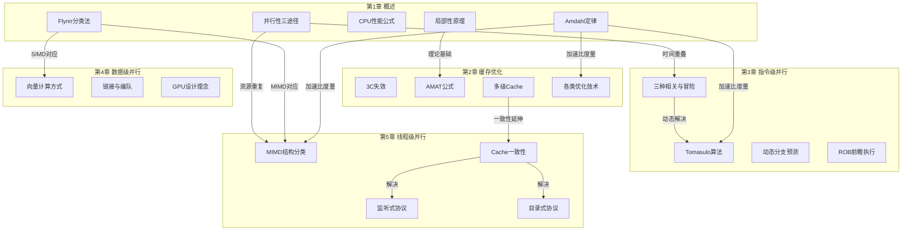

# 计算机系统结构 · 全课程总述

> 本文件覆盖全部五章知识点，适合考前整体复习使用。
> 各章详细例题与推导请参考文末 📁 章节索引。

---

## 🗺️ 这门课在讲什么

计算机系统结构这门课的核心主线，是一场与“性能天花板”持续对抗的演进史。随着单核处理器频率逼近物理极限，系统只能通过层层递进的并行技术来突破瓶颈。课程从第一章的性能量化工具出发，确立了优化的基本标尺；随后在第二章直面 CPU 与内存之间巨大的速度鸿沟，通过缓存机制打破“存储墙”；当数据供给不再是绝对瓶颈时，第三章转向单条流水线内部，榨取指令级并行的潜力；而在单流水线也达到极限后，第四章和第五章分别通过向量处理（数据级并行）和多核互联（线程级并行）实现并行的逐级升维。贯穿全课的核心，始终是在不同的硬件层次上寻找瓶颈，并利用时间重叠或空间重复的手段去化解它。

---

## 🧭 知识演进路线

### 第1章：先把性能量化，再谈优化

在对计算机系统进行任何改造之前，我们必须先有分类的标准和量化的刻度。从宏观架构来看，Flynn 分类法根据指令流和数据流的多寡，将计算机划分为单指令单数据流（SISD）、单指令多数据流（SIMD）、多指令单数据流（MISD）和多指令多数据流（MIMD）。这不仅是体系结构的经典分类，更为后续章节埋下了伏笔：这正是第4章的向量与 GPU（本质上是 SIMD 的延伸）以及第5章的多处理器系统（MIMD 的具象化）的理论基础。在明确了架构归属后，我们追求的核心目标是提升并行性。并行性包含两层含义：同时性指两个或多个事件在同一时刻发生，并发性则指它们在同一时间间隔内交替发生。为了实现这一目标，前人总结出三条经典的技术途径：时间重叠（如第3章的单机指令流水线，或多机异构处理机）、资源重复（如单机重复设置功能部件，或第5章的同构多处理机）以及资源共享（如单机分时系统，或多机分布式系统）。当然，任何架构设计都绕不开经典的冯·诺依曼结构，其“存储程序、按址查线”的特点虽然伟大，但也注定了 CPU 与存储器之间存在天然的依赖。为了打破这种限制，我们引入了局部性原理，即程序在执行时往往会集中访问某一片时间或空间区域的数据。这正是第2章 Cache 设计的绝对理论基石。

有了理论基础，我们需要用数学工具来衡量优化的收益。此时我们引入了著名的 Amdahl 定律：

$$S_n = \frac{1}{(1-F_e) + \frac{F_e}{S_e}}$$

公式中 $F_e$ 是可改进部分的比例，$S_e$ 是该部件加速比。该定律揭示了一个残酷的重要推论：无论局部优化多完美，系统的最大加速比永远不超过 $1/(1-F_e)$。除了加速比，评估单机的基础性能还离不开 CPU 性能公式：

$$T = IC \times CPI \times T_c$$

程序的执行时间取决于指令数（$IC$）、每条指令的平均时钟周期数（$CPI$）以及时钟周期时间（$T_c$）。有了这套度量工具之后，通过计算我们发现，尽管 CPU 运算速度飞快，但由于数据获取太慢，第一个严重的系统级瓶颈——存储器与 CPU 之间的速度鸿沟彻底暴露了出来。

### 第2章：存储墙——向Cache要性能

随着 CPU 速度和存储器速度的差距越来越大，“存储墙”成为了制约性能的头号顽疾。为了评估存储系统的效率，我们引入了平均访存时间公式：

$$AMAT = T_{hit} + P_{miss} \times T_{penalty}$$

公式说明，要降低 AMAT，必须从缩短命中时间（$T_{hit}$）、降低不命中率（$P_{miss}$）和减少不命中开销（$T_{penalty}$）三个维度入手。不命中的根源可以归结为 3C 失效：冷启动带来的强制性不命中、Cache 太小导致的容量不命中，以及映射位置争抢引发的冲突不命中。针对 3C，最直接的思路是增大块大小（缓解强制性）、增大容量（缓解容量）或提高相联度（缓解冲突）。但提高相联度的代价是多路选择器会拖慢命中时间，这正是优化手段互相制约的典型体现。为了在直接映像的速度和组相联的命中率之间找折中，伪相联技术应运而生。同时，为了主动出击，硬件预取与编译器预取（分为故障性与非故障性）提前把数据搬到缓冲器，编译器优化（如数组合并、分块等）则通过调整软件访存顺序配合硬件；对于因冲突被挤出的数据，牺牲 Cache 提供了一个极小的全相联缓冲来“兜底”。

当失效率无法进一步压低时，我们转而尝试降低失效开销。引入两级 Cache 是最经典的做法，在此需要特别注意局部不命中率（仅针对当前级）与全局不命中率（针对整个系统访存）的评估差异。此外，利用写缓冲器合并数据、让读不命中优先于写以避免阻塞，以及采用请求字处理技术（尽早重启动/请求字优先）提前把 CPU 急需的字送回，都是为了掩盖等待时间；非阻塞 Cache 更是允许在处理一次不命中的同时继续响应其他命中请求。而在缩减命中时间方面，采用小容量简单结构、虚拟 Cache（省去地址转换）、Cache 访问流水化以及踪迹 Cache 都是有效的策略。Cache 问题解决后，数据供给终于跟上了节奏，但此时程序员发现，流水线里的数据相关和控制相关才是下一个绊脚石。

### 第3章：流水线——向指令级并行要性能

流水线让多条指令像工厂作业一样重叠执行，极大地提升了吞吐率，但指令间的相互依赖会让流水线被迫停顿。这些依赖分为三种：数据相关（真相关）、名相关（仅仅是寄存器名字冲突，含反相关和输出相关）和控制相关（分支指令决定走向）。它们分别在流水线中引发了写后读（RAW）、读后写（WAR）/写后写（WAW）以及控制冲突。为了解决这些冒险，我们面临两种选择：静态调度依靠编译器在执行前重排指令（如循环展开），简单但缺乏运行时信息；动态调度则依靠硬件在运行时调整执行顺序，能够有效处理那些在编译期情况不明的相关性，这是其核心优势。

为了彻底释放指令级并行的潜力，Tomasulo 算法成为了动态调度的巅峰之作。它通过引入保留站，巧妙地实现了“记录相关”：操作数一旦就绪就立刻执行，解决了 RAW 冒险；同时利用“寄存器换名”技术，彻底消除了由名相关引起的 WAR 和 WAW 冲突。在它的流出、执行、写结果三个阶段中，指令乱序执行，结果通过公共数据总线直接广播，绕过了寄存器文件的瓶颈。然而，控制相关依然是悬在头顶的剑。为此，动态分支预测技术不断升级：从简单记录历史跳转方向的分支历史表（BHT），到能直接缓存跳转目标地址的分支目标缓冲器（BTB），再到为了支持前瞻执行而引入的重排序缓冲（ROB）。ROB 允许指令跨越尚未确定的分支进行“先执行”，把推测的结果暂存起来，直到分支条件确认无误后，才让结果安全落地。通过这些复杂的硬件机制，单条流水线的标量指令并行度已经接近极限，更宽的并行需要突破逐条取指的框架，同时操作多个数据元素。

### 第4章：向量与GPU——向数据级并行要性能

当同一操作需要施加于大批量数据时，传统的标量流水线反复取指、译码是纯粹的资源浪费。此时，我们向数据级并行寻求出路，这正是第一章 SIMD 概念的延伸。向量处理器在处理数据时存在横向、纵向和纵横三种计算方式，其中纵向计算（按列处理）最适合向量硬件，因为它能完美契合流水线结构并消除中间结果的存取开销。实际应用中，数据长度往往不固定且带有条件分支，这就需要向量长度寄存器（VL）来控制有效处理长度，以及向量屏蔽寄存器（VM）来标记参与运算的元素。为了进一步提升吞吐率，硬件上采用了多车道技术，让多个处理单元并行干活。

在处理存在“写后读”关系的相邻向量指令时，如果强行等待，流水线将面临巨大停顿。链接技术巧妙地让前一个指令产生的数据直接流向后一个指令的运算单元，“头尾相接”形成极长的流水线（这与第3章流水线数据定向的思想同源，但规模更大）。当多条无结构冒险的指令能够同时发射执行时，它们就构成了一个编队；而面对超长向量，编译器采用分段开采技术，将其自动切割成硬件寄存器能容纳的片段循环处理。这种对数据并行的极致追求，最终孕育了现代 GPU。CPU 的设计理念是“少核深流水重控制”，将空间让给 Cache 和调度逻辑；而 GPU 则是“多核浅流水重计算”，省去复杂控制，用海量 ALU 暴力提升吞吐量。为了让软件更好地调度，GPGPU 虚拟化将物理 GPU 的计算能力在时间片上切片，让多用户可以高效共享。然而，无论单机算力如何膨胀，终究有物理天花板，扩展到多核心、多处理器架构又带来了全新的共享数据一致性挑战。

### 第5章：多核互联——向线程级并行要性能

当多个处理器共享同一份物理内存数据时，一旦有人将数据读入各自的私有 Cache 中进行修改，“谁改了数据其他人不知道”就成了致命的系统错误。这也就是第五章要解决的 Cache 一致性问题。在解决它之前，我们需要先理清多处理器的组织形态。根据存储共享方式，MIMD 架构分为五种结构：并行向量处理机（PVP）、对称多处理机（SMP）、分布式共享多处理机（DSM）、大规模并行处理机（MPP）和工作站集群（COW）。它们被宏观归类为“单地址空间共享存储”（所有核通过单一物理地址寻址）和“多地址空间非共享存储”（各节点独立内存，靠消息传递通信）。而 Cache 一致性问题的根源，正是允许共享数据进入本地私有 Cache 后，修改操作导致的多副本数据失步。

针对这个根源，协议层有两大阵营：写作废和写更新。在多次写无读、或对单一 Cache 块进行写操作的场景下，写更新会引发大量无用的总线广播开销，因此写作废协议成为了主流选择。在共享总线架构中，监听式协议大放异彩。它依靠总线广播和各节点监听来维持一致性，最经典的就是包含无效（I）、共享（S）、修改（M）的三状态机。当某节点发生写命中或写失效时，会在总线上发出作废信号，其他拥有副本的节点监听到后，会触发被动失效，被迫将自身状态降级为无效。但监听协议严重依赖广播，极易导致总线拥堵。为了提升大规模系统的可扩放性，DSM 架构采用了目录式协议。它用一个集中的数据结构替代广播，区分了本地节点（发起者）、宿主节点（拥有物理内存和目录）和远程节点（拥有副本）。根据对共享集合记录方式的不同，目录又分为全映像（耗费存储）、有限映像（限制最大副本数）和链式结构（利用指针串联）。这三种目录结构完美展现了计算机体系结构中“空间与扩展性”的终极取舍。

---

## 🔗 跨章关联图

---

## 🔑 贯穿全课的核心思想

1. **量化设计原则（Quantitative Approach）**
这是整门课的灵魂。无论是通过 Amdahl 定律评估局部优化的全局收益，还是利用 CPU 性能公式计算执行时间，抑或是用 AMAT 公式权衡 Cache 命中率与命中时间的取舍，计算机系统结构的设计从不是凭空臆想，而是建立在严谨的数学推导之上。
2. **局部性原理（Locality）**
时间局部性和空间局部性不仅是第二章存储层次设计的绝对基石，其思想也贯穿了全局。例如第四章向量处理之所以高效，正是因为大规模连续数据天然具备极强的空间局部性；而第五章 Cache 一致性协议的频繁触发，本质也是因为多核间的局部性碰撞。
3. **时间与空间的权衡转换（Trade-offs between Time and Space）**
为了提高速度（时间），硬件设计者不断通过堆叠资源（空间）来换取性能。从增加 Cache 的相联度，到第三章增加保留站与 ROB 表项，再到第五章增加处理机核心，本质上都是利用空间复杂度的上升来换取执行时间的缩短。
4. **让大概率事件变得更快（Make the Common Case Fast）**
这源于 Amdahl 定律的核心启示。处理器的设计总是优先照顾最常发生的场景。例如在分支预测中优先假设历史规律会重复，或在 Cache 设计中优先保障命中时的低延迟（甚至为此牺牲一定的失效率），以此来获取系统整体最高的统计学收益。

---

## 📊 考试重点速查

| 章节 | 简答题高频考点 | 计算题核心方法 |
| --- | --- | --- |
| 第1章 概述 | Flynn分类法、Amdahl定律推论、并行性三途径、局部性原理、冯诺依曼特点 | Amdahl加速比公式、CPU性能公式（CPI计算、执行时间） |
| 第2章 缓存优化 | 3C失效定义与对策、各优化方法的缺点分析、故障性vs非故障性预取 | AMAT公式、两级Cache全局/局部不命中率、伪相联AMAT推导 |
| 第3章 指令级并行 | 三种相关与冒险、静态vs动态调度优点、Tomasulo核心思想、三种分支预测方法 | Tomasulo/ROB状态表填写、循环展开与指令调度 |
| 第4章 数据级并行 | 向量vs GPU设计差异、三种计算方式、VL/VM作用、链接/编队/分段开采思想 | 向量链接执行时间：通过时间 + (N-1) |
| 第5章 线程级并行 | MIMD五种结构特点、Cache一致性根源、写作废vs写更新、监听式/目录式协议原理 | 监听式协议三状态表推演（I/S/M状态跳变与总线操作） |

---

## 📁 章节索引

| 章节 | 文件 | 核心关键词 |
| --- | --- | --- |
| 第1章 概述 | `第1章_概述.md` | Flynn分类、Amdahl定律、CPU性能公式、并行性、局部性 |
| 第2章 缓存优化 | `第2章_缓存优化.md` | AMAT、3C失效、伪相联、两级Cache、不命中率 |
| 第3章 指令级并行 | `第3章_指令级并行.md` | Tomasulo、ROB、BHT、BTB、循环展开、动态调度 |
| 第4章 数据级并行 | `第4章_数据级并行.md` | 向量链接、编队、GPU、VL/VM、分段开采 |
| 第5章 线程级并行 | `第5章_线程级并行.md` | MIMD、Cache一致性、监听式协议、目录式协议、写作废 |
