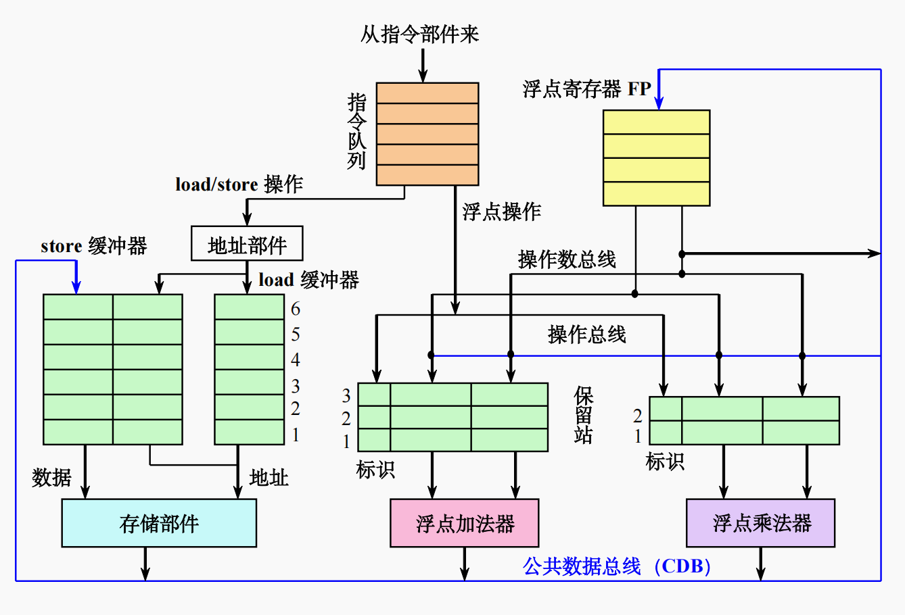
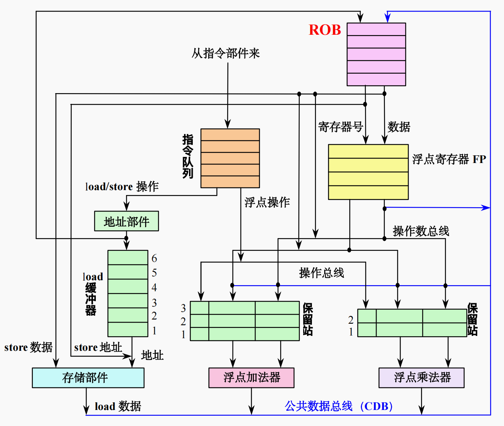

---

# ROB 前瞻执行 专项详解

## 📌 本节定位

> 本节是“计算机系统结构”中最核心、考试占比极大的计算题考点。它解决了 Tomasulo 算法无法处理分支预测错误和精确异常的致命缺陷。考试中，你通常需要在一张巨大的表格里，**逐周期追踪指令的流出、执行、写结果和确认状态**，或者**填补在某一个特定时钟周期下的 ROB、保留站和寄存器的状态**。本节的目标就是让你形成肌肉记忆，看到指令流就能无脑推演。

---

## 🧱 前置知识

**在学习本算法之前，你需要理解以下概念。**

### Tomasulo 算法（动态调度基础）

**是什么：**
允许指令在操作数准备好时就立刻执行（乱序执行），通过保留站（Reservation Station）和公共数据总线（CDB）消除 RAW（先写后读）、WAW（写后写）和 WAR（读后写）冲突。

**为什么需要它：**
传统的静态流水线只要遇到一条指令被阻塞，后面的指令全都要排队等待。Tomasulo 把等不到操作数的指令先“晾”在保留站里，让后面的指令先走。

### 动态分支预测 (Dynamic Branch Prediction)

**是什么：**
硬件在分支指令还没计算出真实跳转条件时，先“盲猜”一个方向（跳或不跳），并直接沿着这个方向把后续指令取出来执行。

**为什么需要它：**
流水线越深，分支指令算结果要等的周期就越长。如果不预测，流水线就会出现巨大的气泡。

### 精确异常 (Precise Exception)

**是什么：**
当某条指令发生异常（如除以零、缺页）或分支预测失败时，处理器能够瞬间将状态恢复到“这条指令刚要执行，但还未改变任何寄存器或内存”的纯洁时刻，就好像后面的乱序指令从来没执行过一样。

> 💡 **直觉理解**：你可以把精确异常想象成游戏里的“完美存档点”。如果前面探路（前瞻执行）踩到了陷阱（预测错误或异常），直接读档，不留任何痕迹。Tomasulo 算法没有这个存档功能，写了寄存器就覆水难收了。

---

## 💡 算法思想

**本节回答：这个算法究竟在做什么？它为什么这样设计？**

### 问题背景：它解决了什么困境？

在纯粹的 Tomasulo 算法中，指令只要算出结果，就会立刻通过 CDB 写回真实的寄存器。
这带来了一个灾难性的困境：如果你为了追求极致性能，在遇到 `if` 分支时“猜”了一个方向并提前执行了后面的指令（前瞻执行），且这些指令把计算结果写进了寄存器。一旦几周期后发现分支猜错了，**寄存器已经被污染了**，你无法撤销这些写操作，程序逻辑就彻底崩溃了。
此外，如果发生中断，由于指令是乱序写回的，你很难找到一个干净的“现场”来保存。

### 核心思路：设计者如何思考？

为了解决“覆水难收”的问题，设计者引入了一个核心理念：**允许乱序执行，但必须顺序确认（In-order Commit）。**

相当于给处理器加了一个“隔离审查区”。所有乱序算出来的数据，先不准写进真实的物理寄存器或内存，而是强制暂存到一个叫做 **重排序缓存（ROB, Reorder Buffer）** 的队列里。只有当这条指令变成队列中最老的一条，且确认它之前的指令都没有发生分支预测错误或异常时，它才能从 ROB 毕业（Commit），真正把数据写进物理寄存器或内存。

### 关键数据结构

这是你做题时必须填写的核心表单。

| 数据结构 | 字段/内容 | 含义 | 何时写入 / 何时清空 |
| --- | --- | --- | --- |
| **ROB** <br>

<br> (重排序缓存) | 指令类型 | 表明是分支、Load/Store 还是 ALU 指令。 | 流出时写入，确认时清空（或标记为空闲）。 |
|  | 目标地址 | 结果要写往的最终归宿：寄存器号或内存地址。 | 流出时写入。 |
|  | 数据值 | 前瞻执行算出来、还没确认的临时结果。 | 写结果阶段（监听 CDB）写入。 |
|  | 就绪状态 | 该指令的结果是否已经算完并存入 ROB。 | 写结果阶段置为 Yes。 |
| **保留站** <br>

<br> (RS) | `Dest` 字段 | **（核心变化）** 指向该指令对应的 ROB 项编号。 | 流出时分配，写结果时释放。 |
| **寄存器状态表** | `ROB项编号` | **（核心变化）** 不再指向保留站，而是指向产生该寄存器最新值的 ROB 编号。 | 流出时预约，确认时清空（如果没被后续指令覆盖）。 |

### 算法与前序方案的对比

<table>
  <tr>
    <td align="center">
      <br>
      回顾：基于Tomasulo算法的MIPS处理器浮点部件的基本结构
    </td>
    <td align="center">
      <br>
      支持前瞻执行的浮点部件的结构
    </td>
  </tr>
</table>

| 对比维度 | Tomasulo 算法 | 基于 ROB 的前瞻执行 |
| --- | --- | --- |
| **换名依据** | 指向**保留站 (RS)** | 指向 **ROB 项编号** |
| **写结果去向** | CDB 直接写入真实寄存器 | CDB 写入等待的保留站和对应的 **ROB 数据项** |
| **执行完毕标志** | 写结果阶段结束即完成 | 必须经历**确认 (Commit)** 阶段才算真正完成 |
| **异常恢复** | 无法完美恢复 | 直接清空 ROB，不影响真实物理状态 |

---

## ⚙️ 核心流程

**本节回答：算法的每一步具体是怎么执行的？**

前瞻执行将指令的生命周期严格分为四个阶段。做追踪题时，必须牢记每个阶段的流转条件。

### 1. Issue (流出)

**触发条件：** 指令队列有指令，且**同时存在**空闲的保留站和空闲的 ROB 项。

**执行动作：**

1. 将指令信息分别填入保留站和 ROB。
2. **寄存器换名**：读取操作数。如果操作数在物理寄存器或 ROB 中已就绪，直接取值；如果没就绪，将产生该值的 **ROB 编号**填入保留站（注意，不再是保留站编号了）。
3. 预约目标寄存器，使其指向当前分配的 ROB 编号。

### 2. Execute (执行)

**触发条件：** 保留站中的两个操作数都已就绪。若是 Load 指令，需等待基址寄存器就绪；若是 Store 指令，只需等基址寄存器就绪即可计算地址（无需等存入的数据）。

**执行动作：**

1. 监控 CDB 获取缺失的操作数。
2. ALU 计算结果 / Load 读取内存 / Store 计算有效地址。

### 3. Write Result (写结果)

**触发条件：** 执行完毕。

**执行动作：**

1. 将计算结果连同分配的 **ROB 编号** 放到 CDB 上广播。
2. 等待该结果的保留站捕获数据。
3. **（关键点）** 对应的 ROB 项捕获数据，并将其“就绪状态”置为 Yes。
4. 释放保留站（此时指令尚未退出流水线，只是腾出了 RS）。

**注意事项：**

* ⚠️ Store 指令在这一步有特殊待遇：如果待写入内存的数据已经算好了，直接放进 ROB；如果还没算好，就死死盯住 CDB，等数据在总线上广播时，一把抓过来塞进自己的 ROB 项里。Store 不在这一步写内存！

### 4. Commit (确认) - ✨ 新增核心段

**触发条件：** 指令到达 ROB 的**队头**（最老指令），并且状态为**已就绪**。

**执行动作：**（分三种情况）

1. **普通指令 (Load/ALU)**：将 ROB 里的数据值正式写入物理目标寄存器，清空 ROB 项。
2. **Store 指令**：将 ROB 里的数据值正式写入真实的**存储器（Memory）**，清空 ROB 项。
3. **分支指令**：
* 预测正确：岁月静好，正常清空 ROB 项退出。
* 预测错误：大扫除！清空整个 ROB 和指令队列，直接从正确的另一条分支重新取指令。（这就是前瞻执行的威力所在，错的全部丢弃，毫发无损）。


**阶段小结：** 确认阶段是守护系统状态纯洁性的最后一道防线，保证了外界看来的“顺序执行”假象。

---

> 📋 **流程总结速查卡**
> 指令到达 → [RS与ROB有空位] → **Issue (流出, 换名为ROB号)** → [操作数就绪] → **Execute (计算/算地址)** → [计算完毕] → **Write Result (CDB广播入ROB, 释放RS)** → [到达ROB队头且就绪] → **Commit (写入真寄存器/内存/猜错清空)**

---

## 📐 例题精解

### 课件例题

课件中给出了两道极具代表性的例题。第一道是浮点运算周期状态快照，第二道是带有循环的 MIPS 整数流水线全周期追踪。这几乎涵盖了所有考法。

---

**【例题 1】（浮点前瞻执行状态快照题）**

**题目描述：**
假设浮点功能部件延迟：加减法 2 周期，乘法 10 周期，除法 40 周期。
有以下代码段：

1. `L.D F6, 34(R2)`
2. `L.D F2, 45(R3)`
3. `MUL.D F0, F2, F4`
4. `SUB.D F8, F6, F2`
5. `DIV.D F10, F0, F6`
6. `ADD.D F6, F8, F2`
**求：当指令 `MUL.D` 即将确认时（即第 16 周期末），保留站、ROB 和浮点寄存器的状态表内容。**

**审题要点：**

* 初始条件：所有部件空闲。
* 要追踪的信息：需要推演到 `MUL.D` 算完并在 ROB 就绪，准备 Commit 的那个瞬间。根据课件推演，这发生在 Cycle 16。
* 执行规则约定：单流出（每周期只能 Issue 一条）。

**解题推演与状态展示（Cycle 16）：**

在第 16 周期时，前两条 `L.D` 早就确认完毕了。`MUL.D` 经过了 10 个周期的漫长计算，终于在第 16 周期完成了“写结果（Write Result）”，算出了值 $Z$，因此处于即将确认的状态（等待第 17 周期 Confirm）。
此时，`SUB.D` 早在第 8 周期就算完了值 $X$ 并在 ROB 里苦等；`ADD.D` 也在第 11 周期算完了值 $Y$ 并在 ROB 里苦等。唯独 `DIV.D` 还在等待 `MUL.D` 的结果，刚拿到数据。

**1. 保留站状态（Cycle 16 末）：**

由于大部分指令已经算完并“写结果”，释放了保留站，此时只有 `DIV.D` 霸占着保留站准备开始漫长的 40 周期计算。

| 名称 | Busy | Op | Vj | Vk | Qj | Qk | Dest | A |
| --- | --- | --- | --- | --- | --- | --- | --- | --- |
| Add1 | no |  |  |  |  |  |  |  |
| Add2 | no |  |  |  |  |  |  |  |
| Add3 | no |  |  |  |  |  |  |  |
| Mult1 | no |  |  |  |  |  |  |  |
| Mult2 | yes | DIV.D | $Z$ | Regs[F6] |  |  | #5 |  |

**2. ROB 状态（Cycle 16 末）：**

`L.D` 已经确认，在部分实现中，状态显示为“已确认（Commit）”且 Busy 为 no。其余指令均在 ROB 中。

| 项号 | Busy | 指令 | 状态 | 目的 | Value |
| --- | --- | --- | --- | --- | --- |
| 1 | no | `L.D F6, 34(R2)` | 确认 | F6 | Mem[34+Regs[R2]] |
| 2 | no | `L.D F2, 45(R3)` | 确认 | F2 | Mem[45+Regs[R3]] |
| 3 | yes | `MUL.D F0, F2, F4` | 写结果 | F0 | $\#2 \times \text{Regs}[F4]$ (即 $Z$) |
| 4 | yes | `SUB.D F8, F6, F2` | 写结果 | F8 | $\#1 - \#2$ (即 $X$) |
| 5 | yes | `DIV.D F10, F0, F6` | 执行 | F10 |  |
| 6 | yes | `ADD.D F6, F8, F2` | 写结果 | F6 | $\#4 + \#2$ (即 $Y$) |

**3. 浮点寄存器状态表（Cycle 16 末）：**

记录当前哪个寄存器的最新值由哪个 ROB 项负责产生。注意 F6 发生了一次覆盖（被 ADD.D 覆盖，指向 #6）。

| 字段 | F0 | F2 | F4 | F6 | F8 | F10 | ... | F30 |
| --- | --- | --- | --- | --- | --- | --- | --- | --- |
| ROB 项编号 | 3 |  |  | 6 | 4 | 5 |  |  |
| Busy | yes | no | no | yes | yes | yes | ... | no |

**结论：**
在乱序执行下，尽管 `SUB.D` 和 `ADD.D` 早就计算完毕了，但因为横亘在它们前面的 `MUL.D` 还没有 Commit，它们只能在 ROB 中乖乖排队，绝对不允许去修改真实的寄存器，从而保证了精确异常的可能。

---

**【例题 2】（整数 MIPS 流水线全周期追踪题）**

**题目描述：**
单流出处理器，采用基于 Tomasulo 的前瞻执行（IS算法）。

* 硬件：1个 LSU (内部自带加法器用于算地址)，2个 LS缓冲器，1个加法 ALU，1个乘法 ALU，2个 ALU 保留站。
* 策略：总是预测分支失败。ROB 空间足够。
* 周期延迟设定：Issue=1, WtCDB=1, Mem=3, Commit=1。
* 运算部件延迟：LD=1, ST=1, SUB=4, BNEZ=4, ADD=4, MUL=10。
代码如下：

```assembly
Loop:
  LD   R2, (R1)
  MUL  R2, R2, #2
  ST   R2, (R1)
  SUB  R1, R1, #4
  BNEZ R1, Loop
  ADD  R5, R3, R4

```

**求：(1) 指令执行状态时钟周期表； (2) 第 16 周期末的各状态表内容。**

**审题要点：**

* `BNEZ` 预测失败，所以会顺着往下取 `ADD` 指令进行前瞻执行。
* `ST` 指令的第二个操作数（要写入的数据，即被 MUL 算出的 R2）没就绪时，可以先进入 EX 阶段算好地址，然后监听 CDB。等到数据后写入 ROB，最后在 Commit 阶段连同之前算好的地址一起写入 Mem。
* `ADD` 指令遇到了结构冲突：只有 2 个 ALU 保留站。前面的 MUL 和 SUB 各占了一个，ADD 必须等到其中一个“写结果”释放保留站后，才能 Issue。

**解题过程 (1)：指令执行状态时钟周期表**

逐周期推进。必须严格遵守单流出，且严格遵循依赖关系。

| 指令 | IS | EX | MEM | WtCDB | Cmt | 备注 |
| --- | --- | --- | --- | --- | --- | --- |
| `LD R2, (R1)` | 1 | 2 | 3-5 | 6 | 7 | 数据读取耗时 3 周期。 |
| `MUL R2, R2, #2` | 2 | 7-16 | Null | 17 | 18 | 等待 LD 写 CDB (第 6 周期)，第 7 周期开始执行 10 周期。 |
| `ST R2, (R1)` | 3 | 4 | 20-22 | 18 | 19 | EX 阶段仅算地址。在 WtCDB (18) 抓取 MUL 刚在 17 播出的数据入 ROB。Commit (19) 后写内存 (20-22)。 |
| `SUB R1, R1, #4` | 4 | 5-8 | Null | 9 | 20 | R1 已在保留站换名，不冲突。执行 4 周期。等待队头的 ST Commit 后才能 Commit。 |
| `BNEZ R1, Loop` | 10 | 11-14 | Null | 15 | 21 | 等 SUB 的 R1 (第 9 周期)，第 11 执行 4 周期。分支失败。等头节点 Commit。 |
| `ADD R5, R3, R4` | 16 | 17-20 | Null | 21 | 22 | 遇到**保留站冲突**！必须等 SUB 在第 9 周期写结果释放 ALU 保留站，为何第 16 周期才流出？因为它是 BNEZ 后面的前瞻指令，前面因为结构限制被卡住。 |

**关键决策点解析：**

> **ST 为什么能在数据没算出来前就去 EX 阶段？并且 MEM 为什么是 20-22？**
> 这是前瞻执行中 Store 的特殊规则（极其易错！）。Store 的执行（EX）只做一件事情：算有效地址。只要基址寄存器 R1 准备好了（在周期 3 就准备好了），周期 4 就可以算地址。然后 ST 在一旁监听 CDB，等到第 17 周期 MUL 算出数据，第 18 周期 ST 把数据写入 ROB (WtCDB)。此后必须等到它变成 ROB 队头（第 19 周期 Commit），才被允许把数据真正写入物理内存（MEM 阶段 20-22 周期）。

**解题过程 (2)：第 16 周期末各状态表内容**

在第 16 周期末，`LD` 已经确认，`MUL` 刚刚执行完第 10 个周期还没 WtCDB，`SUB` 和 `BNEZ` 都已经算完在 ROB 里干等。`ADD` 刚刚在第 16 周期 Issue 成功。

**保留站状态表：**

| Label | Busy | Op | Vj(rs) | Vk(rt) | Qj(rs) | Qk(rt) | A(Imm) | Dest |
| --- | --- | --- | --- | --- | --- | --- | --- | --- |
| Load1 | N |  |  |  |  |  |  |  |
| Load2 | Y | ST | Reg[R1] |  |  | ROB2 | Reg[R1] | ROB3 |
| ALU1 | Y | MUL | Reg[R2] | #2 |  |  |  | ROB2 |
| ALU2 | Y | ADD | Reg[R3] | Reg[R4] |  |  |  | ROB6 |

*(补充理解：课件这里的 `ALU2` 被复用，SUB 和 BNEZ 用完释放后，被 ADD 占据。)*

**ROB 状态表：**

| Label | Busy | Op | Target | Value | State |
| --- | --- | --- | --- | --- | --- |
| ROB1 | N | LD |  |  | 已确认 |
| ROB2 | Y | MUL | R2 |  | 已执行 (等WtCDB) |
| ROB3 | Y | ST | Mem(Reg[R1]) |  | 已执行 (等数据与WtCDB) |
| ROB4 | Y | SUB | R1 | Reg[R1]-4 | 已写结果 |
| ROB5 | Y | BNEZ | #Loop | Reg[R1]-4 | 已写结果 |
| ROB6 | Y | ADD | R5 |  | 已流出 |

**寄存器状态表：**

|  | R1 | R2 | R3, R4 | R5 |
| --- | --- | --- | --- | --- |
| ROB | ROB4 | ROB2 |  | ROB6 |
| Busy | Y | Y |  | Y |

**结论：**
通过周期表可以清晰看出，由于严格要求 In-order Commit，即便 `SUB` 在第 9 周期就广播了结果，它也必须足足等到第 20 周期，眼巴巴看着排在它前面的 `ST` (19周期) 走完 Commit 流程，才能正式退休。这就是精准异常的代价与魅力。

---

## ⚠️ 易错点与变体提醒

**本节整理考试中最常见的失分陷阱与变体情形。**

### ❌ 错误认知 1：把保留站编号填进寄存器状态表

**常见错误：** 习惯了纯 Tomasulo，在发生换名时，把 RS 的编号（如 Load1, ALU1）填到寄存器状态表中。
**正确规则：** 在前瞻执行中，寄存器最终是要等待 ROB 把干净数据吐给它的。换名体系的**核心锚点变成了 ROB 编号**（如 #3, ROB2）。

### ❌ 错误认知 2：分支猜错后，在 Execute 阶段就立刻清空流水线

**常见错误：** 看到分支指令在 EX 阶段算出了真实的判断条件，发现猜错了，立刻把后面跟随前瞻执行的指令杀掉。
**正确规则：** **绝对不行！** 你怎么保证分支指令之前没有其他指令发生缺页异常？必须“憋着”。猜错的分支指令算出结果后，只能乖乖写入自己的 ROB 项。直到它**到达 ROB 队头并 Commit 时**，才正式清空 ROB 和重置流水线。这是为了保证发生多个异常/预测错误时，按程序的原始时序进行处理。

### ❌ 错误认知 3：Store 指令在 Write Result 阶段写内存

**常见错误：** 认为 Store 指令既然要存数据，有了数据就在 WtCDB 阶段直接去写存储器。
**正确规则：** 存储器是真实世界的物理状态，污染了无法撤销。Store 在 EX 算地址，在 WtCDB 接收数据存入 ROB，**有且仅有在 Commit 阶段**，才能将 ROB 里的数据搬到内存（MEM操作）。

---

## 🔗 与其他算法的关联

* **Tomasulo → ROB 的演进：** ROB 并不是推翻了 Tomasulo，而是在其“前端乱序 Issue + 中端乱序 Execute/WtCDB”的架构后，加上了一个“后端顺序 Commit”的兜底缓冲区。换名机制的底层逻辑一致，只是引用指针从 RS 移到了 ROB。

希望这份详尽的梳理能帮你彻底击穿“ROB前瞻执行”的计算题！只要在做题时脑海中浮现出那个“乱序闯关，排队发证（Commit）”的直觉，就能保证状态表万无一失。加油！