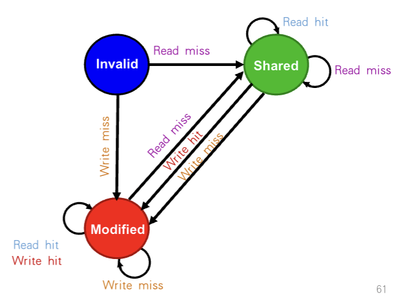
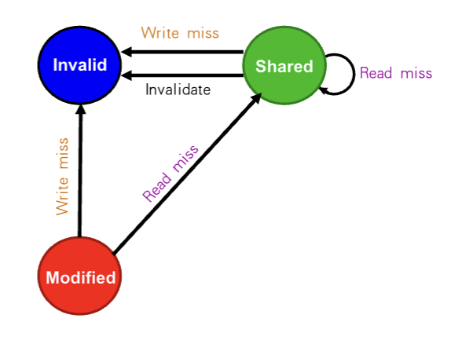
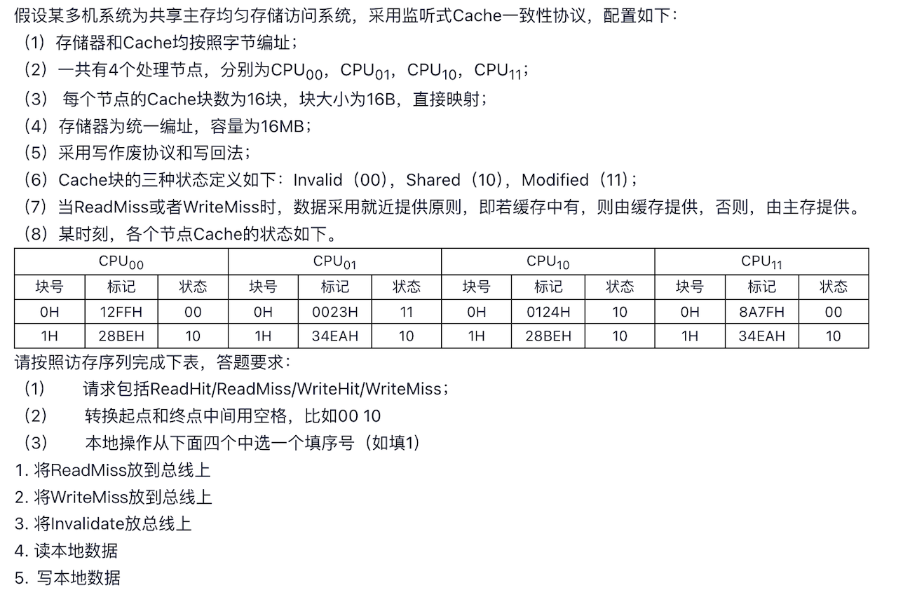
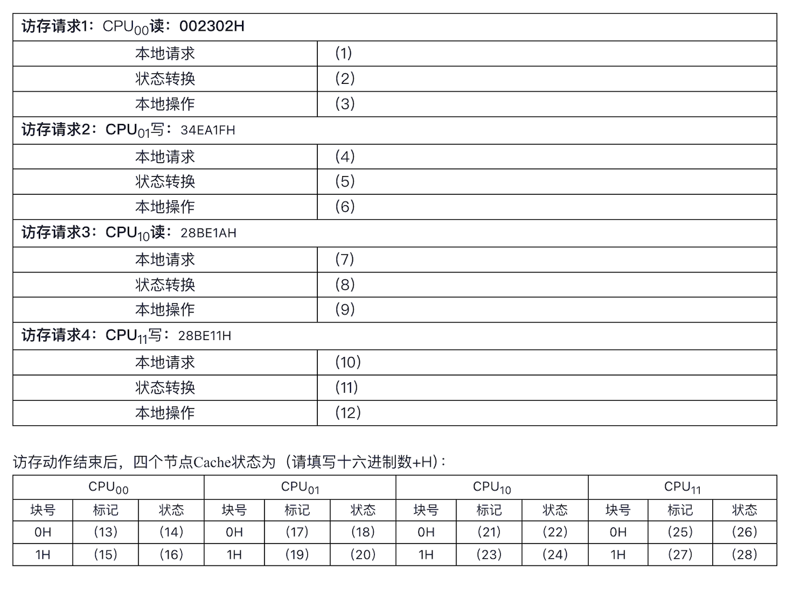

---

# 监听协议 (Snooping Protocol) 专项详解

## 📌 本节定位

> 监听协议是解决**对称多处理机（SMP）Cache 一致性问题**的核心机制。考试中通常以**状态追踪表格题**的形式出现，要求你根据一系列访存指令，准确推演出各个 CPU 内部 Cache 块的状态变化与总线动作。我们的目标是建立对 MSI 三大状态的直觉，做到无需死记硬背即可独立推演。

---

## 🧱 前置知识

**在学习本算法之前，你需要理解以下概念。**

### Cache 一致性危机

**是什么：**
当多个 CPU 各自拥有私有 Cache，且都共享同一个主存时。如果 CPU A 读取了变量 $X$，随后 CPU B 也读取并**修改**了变量 $X$，此时 CPU A 的 Cache 里保留的还是旧数据，这就产生了“脏数据”危机。

**为什么需要它：**
为了保证程序员眼中的内存是“统一且一致的”，我们必须设计一套规则，保证一旦某个人修改了数据，其他所有人手里的副本要么跟着更新，要么立刻被撕毁。

### 写作废 (Write Invalidate) vs 写更新 (Write Update)

**是什么：**

* **写更新**：我改了数据，立刻通过广播把新数据塞给所有人。（开销大，总线容易拥堵）
* **写作废**：我改了数据，通过广播告诉所有人“你们手里的副本全部作废”。下次你们想用，自己去主存或者我这里拿新的。（课件与本题默认采用的策略）

> 💡 **直觉理解**：这就像共享文档。写更新是你每次敲一个字，都要群发一次新文档；写作废是你只在群里喊一句“文档我改了，你们手里的版本作废”，等别人真正需要看的时候，再来找你要最新版。显然，**写作废**更省带宽。

---

## 💡 算法思想

### 问题背景：它解决了什么困境？

在没有监听协议之前，CPU 根本不知道自己的 Cache 里的数据是否已经被别人改过了。要想保证不出错，每次读写都得去慢吞吞的主存确认，这直接毁掉了 Cache 存在的意义。

### 核心思路：设计者如何思考？

设计者利用了多核系统中的**共享总线 (Shared Bus)**。因为所有 CPU 都挂在同一条总线上，所以总线天然具有“广播”和“串行化”的特性。
核心思路就是：**“大声嚷嚷”与“竖起耳朵”**。
当你缺数据或要改数据时，在总线上“大声嚷嚷”（发请求）；同时，每个 CPU 的 Cache 控制器都要时刻“竖起耳朵”监听总线上的请求。一旦听到别人要动自己手里的数据，立刻做出反应（作废自己，或者把自己的脏数据交出去）。

### 关键数据结构：MSI 状态机

为了让监听有据可依，协议为每一个 Cache 块增加了两位状态位，定义了三种状态（MSI）：

| 状态名称 (英文) | 缩写 | 含义 | 该状态下，数据是最新的吗？ |
| --- | --- | --- | --- |
| **Invalid (无效)** | **I** | 这是一个空块，或里面的数据已被别人作废。 | 无效数据（相当于没有） |
| **Shared (共享)** | **S** | 多个 CPU 都在读。我和别人的副本一模一样。 | 是，且与主存一致 |
| **Modified (修改)** | **M** | 只有我独占这个数据，且我修改过它了。主存里的数据已经过时了。 | **是，全系统唯一的最新数据，与主存不一致** |

**提示**：多个 CPU 共享了同一个内存变量（比如地址 X），那么在任何时刻，全系统所有 CPU 的 Cache 中，针对这个地址的状态绝对不可能同时出现 Modified (M) 和 Shared (S)。

---

## ⚙️ 核心流程

为了在考场上不出错，我们把整个流程分为“我自己的请求 (Local Request)”**和**“监听到总线上的请求 (Bus Snooping)”两部分。

<table>
  <tr>
    <td align="center">
       
      请求来自CPU
    </td>
    <td align="center">
       
      请求来自总线
    </td>
  </tr>
</table>

### 阶段一：我自己的 CPU 发出读/写请求

**触发条件：** 本地 CPU 执行 Load (读) 或 Store (写) 指令。

1. **CPU 读命中 (Read Hit)：** 最开心的情况。状态保持不变，直接读。
2. **CPU 读缺失 (Read Miss)：** 我没有数据，向总线大喊 `ReadMiss`。拿到数据后，状态变为 **S (Shared)**。同时需要注意的是，如果其他匹配的Cache是 **M (Modified)**，则改Cache把数据写回给主存，状态变为 **S (Shared)**。
3. **CPU 写命中 (Write Hit)：**
* 如果我已经是 **M** 状态：直接写，不吱声。
* 如果我是 **S** 状态：我得向总线大喊 `Invalidate`（告诉别人：我要改了，你们都作废）。然后状态升级为 **M (Modified)**。
4. **CPU 写缺失 (Write Miss)：** 我不仅没数据，我还要写。向总线大喊 `WriteMiss`。拿到数据后，状态直接变为 **M (Modified)**。

### 阶段二：我监听到总线上的请求

**触发条件：** 其他 CPU 向总线发出了请求，我偷偷检查我自己的 Cache Tag，发现“命中”了！

1. **监听到别人发 `ReadMiss`：**
* 如果我是 **S**：大家一起读，相安无事，我保持 **S**。
* 如果我是 **M**：**（⚠️高危操作）** 全系统只有我这里有最新数据！我必须立刻中止别人的读取，把我的新数据**写回 (Write Back)** 给主存，或者直接提供给那个 CPU。然后我的独占权被打破，降级为 **S**。

2. **监听到别人发 `WriteMiss` 或 `Invalidate`：**
* 无论我是 **S** 还是 **M**，别人要动笔了，我的数据立刻变成废纸。我的状态无条件降级为 **I (Invalid)**。
* （注意：如果我是 M，在变成 I 之前，我还得负责把脏数据写回）。

---

> 📋 **流程总结速查卡**
> * **要读没数据** $\rightarrow$ 发 `ReadMiss` $\rightarrow$ 变 **S**
> * **要写没独占** $\rightarrow$ 发 `WriteMiss` 或 `Invalidate` $\rightarrow$ 变 **M**
> * **听到别人要读** $\rightarrow$ 降级为 **S**（M 还得负责交出数据）
> * **听到别人要写** $\rightarrow$ 无条件变成 **I**
> 
> 

---

## 📐 例题精解

### 作业例题

<table>
  <tr>
    <td align="center">
       
    </td>
    <td align="center">
       
    </td>
  </tr>
</table>

**【审题要点】**

1. **系统配置**：
* Cache 块大小：16B $\rightarrow$ **块内偏移 (Offset) 占 4 位**。
* Cache 块数：16块 $\rightarrow$ **索引 (Index) 占 4 位**。
* 主存容量：16MB $\rightarrow$ 地址总长 = $\log_2{(16 \times 10^6)}$ 即 24 位。
* **Tag (标记) 长度** = $24 - 4 - 4 = 16$ 位。正好是 4 个十六进制字符。

2. **状态定义**：I = 00, S = 10, M = 11。
3. **策略**：就近提供原则，写作废，写回法。
4. **动作选项**：1. 放 ReadMiss；2. 放 WriteMiss；3. 放 Invalidate；4. 读本地；5. 写本地。

---

**解题过程：物理地址拆解与请求追踪**

为了知道每次访存命中了哪个 Cache 块，我们需要先拆解十六进制地址：

| 访存动作 | 物理地址 | 展开最后两位十六进制 | 偏移 (后4位) | Index (第5~8位) | 提取出的 Tag |
| --- | --- | --- | --- | --- | --- |
| 1. $CPU_{00}$ 读 | `002302H` | `... 0000 0010` | 2 | **0H** | `0023H` |
| 2. $CPU_{01}$ 写 | `34EA1FH` | `... 0001 1111` | F | **1H** | `34EAH` |
| 3. $CPU_{10}$ 读 | `28BE1AH` | `... 0001 1010` | A | **1H** | `28BEH` |
| 4. $CPU_{11}$ 写 | `28BE11H` | `... 0001 0001` | 1 | **1H** | `28BEH` |

现在，我们带着当前的全局初始状态，一步步推演。

#### 访存请求 1：$CPU_{00}$ 读 `002302H`

* **目标定位**：Index = 0H, Tag = `0023H`。
* **本地检查**：$CPU_{00}$ 当前 0H 块的 Tag 是 `12FFH`，且状态为 00 (I)。显然不匹配。
* **本地请求**：发生 **(1) ReadMiss**。
* **状态转换**：$CPU_{00}$ 将新数据装入 0H，Tag 更新为 `0023H`。因为只是读，状态从 I 变 S，即 **(2) 00 10**。
* **本地操作**：因为是 ReadMiss，必须向总线求助，因此操作选 **(3) 1**（将 ReadMiss 放到总线上）。
* **总线监听 (隐含)**：$CPU_{01}$ 的 0H 块正好是 `0023H` 且处于 M (11) 状态。它监听到 ReadMiss，会将数据写回内存提供给 $CPU_{00}$，并将自身状态从 M (11) 降级为 S (10)。

#### 访存请求 2：$CPU_{01}$ 写 `34EA1FH`

* **目标定位**：Index = 1H, Tag = `34EAH`。
* **本地检查**：$CPU_{01}$ 当前 1H 块的 Tag 正好是 `34EAH`，状态为 S (10)。
* **本地请求**：Tag 匹配且有效，发生 **(4) WriteHit**。
* **状态转换**：虽然命中了，但在 S 状态下是不允许直接修改的，必须升级独占权。状态从 S 变 M，即 **(5) 10 11**。
* **本地操作**：为了升级独占，必须告诉别人作废旧数据，因此操作选 **(6) 3**（将 Invalidate 放到总线上）。
* **总线监听 (隐含)**：$CPU_{11}$ 的 1H 块也是 `34EAH` (状态 S)。它监听到 Invalidate，立刻将自己作废，状态变为 I (00)。

#### 访存请求 3：$CPU_{10}$ 读 `28BE1AH`

* **目标定位**：Index = 1H, Tag = `28BEH`。
* **本地检查**：$CPU_{10}$ 当前 1H 块的 Tag 就是 `28BEH`，状态为 S (10)。
* **本地请求**：Tag 匹配，且是读操作，发生 **(7) ReadHit**。
* **状态转换**：读操作不改变共享状态，即 **(8) 10 10**。
* **本地操作**：直接在 Cache 内拿数据即可，不需要总线动作，选 **(9) 4**（读本地数据）。
* **总线监听 (隐含)**：无请求上总线，大家相安无事。

#### 访存请求 4：$CPU_{11}$ 写 `28BE11H`

* **目标定位**：Index = 1H, Tag = `28BEH`。
* **本地检查**：$CPU_{11}$ 当前 1H 块的 Tag 是 `34EAH` 且刚才被变成了 00 (I)。显然不匹配。
* **本地请求**：发生 **(10) WriteMiss**。
* **状态转换**：获取数据并立刻进行修改，获取独占权，从 I 变 M，即 **(11) 00 11**。（Tag 将被更新为 `28BEH`）。
* **本地操作**：必须向总线索要数据并要求独占，选 **(12) 2**（将 WriteMiss 放到总线上）。
* **总线监听 (隐含)**：$CPU_{00}$ 和 $CPU_{10}$ 的 1H 块 Tag 都是 `28BEH` (状态 S)。它们听到 WriteMiss，立刻将自己作废，状态均变为 I (00)。

---

**最终状态汇总填写**

经历了上述四轮“相爱相杀”，我们来盘点一下四个 CPU 的最终家底：

| CPU 节点 | Index = 0H 的最终状态 | Index = 1H 的最终状态 |
| --- | --- | --- |
| **$CPU_{00}$** | 被 Req 1 替换为了新数据。 Tag = `0023H`，状态 = `10` (S) | 原本是 28BEH (S)，但在 Req 4 中被别人写失效了。 Tag = `28BEH`，状态 = `00` (I) |
| **$CPU_{01}$** | 原本是 0023H (M)，在 Req 1 中被别人读降级了。 Tag = `0023H`，状态 = `10` (S) | 在 Req 2 中升级了独占。 Tag = `34EAH`，状态 = `11` (M) |
| **$CPU_{10}$** | 全程没被碰过。 Tag = `0124H`，状态 = `10` (S) | 原本是 28BEH (S)，经历了 Req 3 读命中，但在 Req 4 中被别人写失效了。 Tag = `28BEH`，状态 = `00` (I) |
| **$CPU_{11}$** | 全程没被碰过。 Tag = `8A7FH`，状态 = `00` (I) | 原本是 34EAH (S)，先在 Req 2 被失效。然后在 Req 4 被替换并修改。 Tag = `28BEH`，状态 = `11` (M) |

**对应空缺答案（注意题目要求十六进制数带 H）：**

* (13) `0023H`    (14) `10`
* (15) `28BEH`    (16) `00`
* (17) `0023H`    (18) `10`
* (19) `34EAH`    (20) `11`
* (21) `0124H`    (22) `10`
* (23) `28BEH`    (24) `00`
* (25) `8A7FH`    (26) `00`
* (27) `28BEH`    (28) `11`

*(补充理解：在 Cache 中，一个块被作废（变为 00 状态）时，通常控制器只修改状态位，不会去刻意清空 Tag 里面的内容。所以在追踪状态时，被 Invalidate 的块，其 Tag 保留原样即可。)*

---

## ⚠️ 易错点与变体提醒

### ❌ 错误认知 1：只要是 Write Hit (写命中)，就直接写本地数据，不需要上总线。

**常见错误：** 看到“命中”二字，就想当然地认为不需要麻烦总线，直接在本地修改。
✅ **正确规则：** 如果你是 **M (Modified)** 状态下的 Write Hit，确实不需要上总线。但如果你是 **S (Shared)** 状态下的 Write Hit，代表不仅你有数据，别人也有。你必须把 `Invalidate` 放到总线上，吼一嗓子作废别人，才能动笔！这就是为什么本题 Req 2 的本地操作必须选 3。

### ❌ 错误认知 2：CPU 发出 Read Miss 时，如果有别的 CPU 处于 M 状态，主存直接提供数据。

✅ **正确规则：** M 状态意味着主存里的数据是**脏的（过时的）**。真正的最新数据在那个处于 M 状态的 CPU 手里。此时，拥有 M 状态的 CPU 会拦截总线，把自己手里的最新数据通过写回 (Write Back) 提供给请求者和主存。

### 变体提示

如果题目中使用了 **MESI** 协议（增加了 E-Exclusive 独占未修改状态），那么在读缺失取回数据，且全系统只有你一个人要读时，状态会变成 E 而不是 S。如果在 E 状态下发生写命中，可以直接变为 M 而不需要在总线上发 Invalidate。

---

## 🔗 与其他算法的关联

监听协议非常精妙，但它有一个致命弱点：**扩展性极差**。
试想一下，如果有一百个 CPU 挂在总线上，每天大家都扯着嗓子喊 `ReadMiss`、`Invalidate`，总线会瞬间瘫痪（广播风暴）。
这就是为什么课件后半部分引入了 **目录协议 (Directory Protocol)** —— 既然不能在大街上广播，那就搞一个“户口本（目录）”记下来这个数据现在在谁手里，谁要改，我私信通知那几个拥有者作废即可。这也是你后续复习的重点衔接方向！